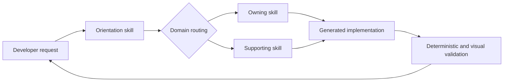
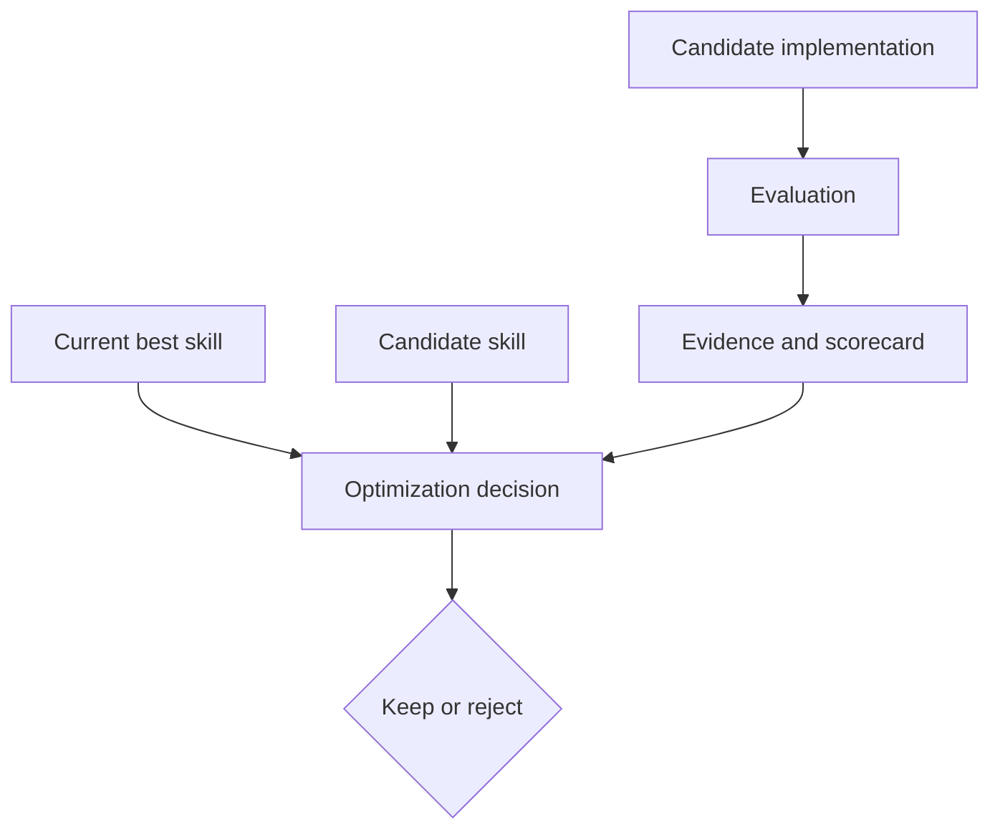

# System Overview

CesiumJS Agent Skills is a documentation-first runtime: skill metadata handles discovery,
the orientation package handles routing, and focused Markdown guidance supplies the API
patterns an agent needs to implement a request.

## Request flow

The orientation skill establishes shared conventions and selects domains. Domain skills
then contribute concrete constructors, lifecycle guidance, common failure modes, and
performance practices. Multi-domain tasks load multiple skills; ownership remains unique
even when usage crosses domain boundaries.

## Architectural layers

| Layer | Responsibility | Canonical source |
| --- | --- | --- |
| **Orientation** | Explain the collection, choose output conventions, and route work | `skills/using-cesiumjs-skills/` |
| **Domain guidance** | Own public APIs and implementation patterns for one CesiumJS concern | `skills/cesiumjs-*/` |
| **Evaluation** | Determine whether an implementation satisfies a known behavior contract | `evaluation/` |
| **Optimization** | Compare candidate skill changes and decide whether they improve the current guidance | `optimization/` |
| **Reference architecture** | Record decisions, constraints, and framework design | `.architecture/` and `wiki/` |

## Progressive disclosure

Skills are intentionally independent packages. Agents first see compact metadata, then
load the full skill only when the request matches. Large references belong beside the
owning skill and are read only when a task needs that detail.

This keeps context focused and avoids three common failure modes:

- loading the entire CesiumJS API for a narrow task;
- duplicating the same symbol guidance across several skills;
- allowing long reference material to hide critical implementation constraints.

## Domain ownership

Every public CesiumJS symbol has one primary owner. Cross-domain examples may use a
symbol, but they should point back to its owner rather than redefining it. For example, an
entity-tracking camera workflow uses both entity and camera concepts, while the camera
API remains owned by the camera skill.

See [Domain Mapping](domain-mapping.md) for the routing model and the canonical symbol
inventory.

## Evaluation boundary

Evaluation and optimization are deliberately separate:

Evaluation answers whether behavior is correct. Optimization uses evaluation evidence to
decide whether candidate guidance should replace or update the current best skill. Pure
evaluation never proposes or promotes a skill change.

## Repository boundaries

- `skills/` is the product surface consumed by agents.
- `evaluation/` contains candidate-agnostic cases, fixtures, schemas, and scorecard logic.
- `optimization/` contains scenarios, browser runners, pairwise judging, and promotion history.
- `wiki/` contains long-form mapping and architecture material.
- `docs/` presents the supported contributor and user journeys without replacing those sources.

For the complete design, read the
[Architecture Concept Document](https://github.com/CesiumGS/cesiumjs-skills/blob/main/wiki/Architecture-Concept-Document.md).
