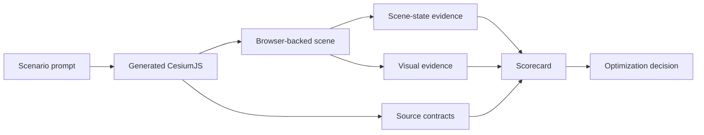

# Evaluation & Optimization

The repository treats correctness measurement and skill improvement as related but
separate systems. This boundary keeps scorecards reproducible and prevents evaluation
code from silently changing the product it measures.

## The boundary

| Evaluation | Optimization |
| --- | --- |
| Asks whether an implementation satisfies the requested behavior | Asks whether candidate guidance should replace or update the current best skill |
| Uses candidate-agnostic cases, fixtures, and checks | Uses scenarios, generated candidates, browser runs, judges, and decision history |
| Must not mutate `skills/` or make promotion decisions | May propose and promote skill changes after evidence is reviewed |
| Produces deterministic scorecards and qualitative evidence | Produces keep, reject, or tie decisions |

## Evidence flow



## Deterministic evaluation

Cases under `evaluation/cases/` describe known expected behavior. The framework can check
runtime health, required or forbidden code patterns, entity state, spatial deltas, camera
targets, JSON values, collection counts, and other explicit contracts.

Run the evaluation unit tests and validator from the repository root:

```bash
pytest -q evaluation/tests
python3 evaluation/scripts/validate-evaluation.py
```

Generate a scorecard for a captured evidence bundle with:

```bash
python3 evaluation/scripts/run-scorecard.py \
  --case evaluation/cases/cesiumjs-entities/eval-001-translate-marker-east-6m.json \
  --evidence evaluation/fixtures/cesiumjs-entities/eval-001-pass.evidence.json
```

## Browser-backed optimization

Public scenarios under `optimization/scenarios/` describe expected behavior, visual
intent, programmatic checks, capture timing, and regression criticality. Supported
browser scenarios run generated JavaScript in a controlled Cesium scene and preserve
evidence for review.

Run the lightweight optimization checks with:

```bash
pytest -q optimization/tests
python3 optimization/scripts/validate-evals.py
python3 optimization/scripts/check-canonical-eval-surface.py
python3 optimization/scripts/check-public-artifacts.py
```

To reproduce a compatible browser scenario locally, place its generated JavaScript under
`optimization/generated/<skill>/<iteration>/`, configure `CESIUM_ION_TOKEN` only when the
scenario requires it, and run:

```bash
python3 optimization/scripts/run-public-eval.py \
  cesiumjs-camera \
  --iteration candidate \
  --only eval-001
```

Generated code, screenshots, traces, and raw runs are local artifacts and are ignored by
git by default. Never commit access tokens or credential-bearing traces.

## Choosing the right validation lane

| Change | Minimum evidence |
| --- | --- |
| Copy edit with no behavioral change | Skill validation and public-artifact checks |
| New or revised API pattern | Scenario validation, deterministic source contract, and targeted unit tests |
| Visual or camera behavior | Browser execution plus screenshot or scene-state review |
| Evaluation framework code | Evaluation unit tests, validator, and representative scorecard |
| Scenario contract change | Explicit rebaseline, schema validation, and reviewer-visible rationale |

See the source-controlled
[evaluation guide](https://github.com/CesiumGS/cesiumjs-skills/blob/main/evaluation/README.md)
and
[optimization guide](https://github.com/CesiumGS/cesiumjs-skills/blob/main/optimization/README.md)
for implementation-level details.
