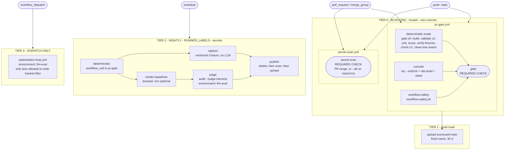

# CI/CD Implementation Plan: Deterministic Evaluation Lane First

Status: Proposed. Supersedes the "CI/CD wiring intentionally deferred" note in
`evaluation/docs/prd-deterministic-scorecard-evaluation.md`.
Date: 2026-08-03
Authority: `evaluation/docs/prd-deterministic-scorecard-evaluation.md` (requirements),
`evaluation/docs/deterministic-evaluation-plan.md` (implementation guidance).

This plan builds a CI/CD pipeline for the entire evaluation side, starting with
and standing alone on the deterministic lane: the blocking, cheap, hermetic,
no-LLM, no-secret gate. Phase 0 through phase 4 ship a required check that runs
in roughly eight seconds of compute, needs zero secrets, runs on hosted runners
only, cannot write a tracked file, and (from phase 2) fails when the evaluator
stops rejecting bad evidence. The visual, qualitative, and optimization lanes are
specified here only as named seams with asserted no-op states, so attaching them
later is additive and detectable rather than a rewrite. The repository is
intended to become public, so every design choice below favors a gate that a
fork contributor can run and that carries no host-specific value or credential
in a tracked file.

---

## 1. Executive summary

### What gets built

Two workflow files replace the current four eval-related ones, plus two composite
actions, plus three shell scripts, plus two small CLI additions. The blocking
surface is two required status checks (`gate` and `secret-scan`), both hermetic
by contract, both secret-free, both hardcoded to hosted runners, both well under
five minutes of wall clock.

### Phase order and what a maintainer holds at the end of each

| Phase | Effort | What the maintainer gets |
|---|---|---|
| 0, toolchain | 0.5 d | One Node version (`.nvmrc` = 22), `engines >= 22` in all three manifests, `packageManager` pinned, the drifting nested console lockfile deleted. No CI change. |
| 1, ship the gate | 1 d | `cesium-eval score` runs in CI for the first time. Console tests run in CI for the first time. `permissions`, `concurrency`, and `timeout-minutes` exist on the eval lane for the first time. Path-filter blindness gone: a lockfile-only PR is now gated. The fork-to-self-hosted execution path is closed. The `${{ inputs.skill }}` injection sink and the commit-back step are deleted. CODEOWNERS lands. One gate definition, runnable locally as `npm run gate`. |
| 2, make the gate two-directional | 1 d | `verify-fixtures` makes the 9 negative fixtures live. A matcher stubbed to always return pass now fails CI. `result.schema.json` is exercised against real results for the first time. Branch protection turns on here, and not before. |
| 3, arm the secret scanner and pin | 1 d + triage | `.gitleaks.toml` actually loads detection rules, with a self-test that fails if it ever stops. `secret-scan` becomes the second required check. All actions SHA-pinned, dependabot watching. |
| 4, close the guard gaps | 1 d | `workflow-safety` enforces the import-direction half of PRD acceptance criterion 9. Matcher coverage is asserted by a unit test. The deterministic gate stops depending on the LLM harness registry. |
| 5, consolidate the expensive lanes | 2 d | One nightly workflow. Error suppression gone. `baseline-audit.yml` and `evals-visual.yml` deleted. Bundle sanitization actually inspects the bundle. |
| 6, real signal without an LLM | 2 to 3 d | Hermetic browser capture against a vendored, pinned CesiumJS. The first input that varies with something other than hand-written JSON. |
| 7, judge lane | 2 d | LLM visual review attached through a seam that phase 1 already asserts, behind an approval environment. |
| 8, governance and polish | 0.5 d | Wiki-sync hardened, host-specific strings removed, coverage ratchet reported. |

### The one thing to internalize before starting

Phases 1 through 5 gate the evaluator, not the evaluatee. A green fixture
scorecard proves the matchers dispatch, the case JSON type-checks, and the
ENU and camera arithmetic is unchanged for known inputs. It cannot prove any
skill got better or worse, because no skill output is in the loop. Phase 6 is
the first phase that changes that, and it needs no LLM. Section 5.1 states this
plainly, and the PRD should carry the same sentence.

---

## 2. Current state

### 2.1 What works

Measured on this tree, warm caches, back to back:

| Command | Exit | Time | Verdict |
|---|:-:|---:|---|
| `npm run build --workspace @cesiumjs-skills/eval` | 0 | 1.08 s | works |
| `npm test --workspace @cesiumjs-skills/eval` (96 tests, 12 files) | 0 | 1.20 s | works, hermetic |
| `validate --suite evaluation` (9 cases, 18 fixtures, 8 skills) | 0 | 0.19 s | works, real gate |
| `validate --suite optimization` (83 scenarios, 14 skills) | 0 | 0.12 s | works, real gate (baseline hash drift) |
| `score --fixture-expectation pass` | 0 | 0.16 s | works, 100.0% |
| `check canonical-surface` | 0 | 0.16 s | works, real gate |
| `check public-artifacts` (164 files) | 0 | 0.16 s | works, real gate |
| `check-secrets.sh` (178 commits, 13.86 MB) | 0 | 1.54 s | mode 1 is inert, see 2.2 |
| console `tsc --noEmit && vite build` | 0 | 3.16 s | works, not tested in CI |
| console `vitest run` (12 tests, 4 files) | 0 | 0.63 s | works, not run in CI at all |

`git status --porcelain` was empty before and after every one of those runs.
Nothing tracked was modified. `score` writes only into gitignored
`evaluation/artifacts/scorecards/` unless `--output-dir` says otherwise.

The seams the later lanes need already exist in the CLI and need no phase-one
code: `score --visual-review <path>`, `--require-visual-review`,
`--harness/--model/--model-variant`, `--evidence <path...>`, `--output-dir`, and
a three-state exit contract (0 pass, 1 regression, 2 malformed input).

### 2.2 What is theater

Five gates in this repository cannot fail, or cannot fail for the right reason.
Every one of them is load-bearing below.

T1. The secret scanner has never scanned anything. `.gitleaks.toml` declares a
single `[allowlist]` block with `paths`, `regexes`, and an empty `commits` array.
There are no `[[rules]]` and no `[extend] useDefault = true`, so gitleaks loads
zero detection rules. Every `check-secrets.sh` mode 1 invocation across three
workflows has reported green for its entire life because it is structurally
incapable of reporting anything else, on a repository that is going public.

T2. The negative fixtures are decorative. `score.ts` filters fixtures by
`expected_result` and then scores every selected fixture against the same pass
threshold. There is no inversion anywhere; the command returns
`overall_result === "pass" ? 0 : 1`. Measured: `--fixture-expectation fail`
exits 1 at 78.0%, `--fixture-expectation all` exits 1 at 89.0%. Neither polarity
can be a green gate, so nothing today verifies that the evaluator rejects bad
evidence. If a matcher degraded to always returning pass, both
`score --fixture-expectation pass` and `validate` would stay green.

T3. Negative fixture coverage is much thinner than it looks. Only five of eleven
matchers are ever driven to fail by a fixture: `json_value_equals` (6),
`entity_translation_delta` (2), `camera_target_view` (1), `artifact_text_absent`
(1), `json_value_compare` (1). `pattern_present` and `pattern_absent` are used by
zero evaluation cases, and `camera_target_view` has no unit test at all. The one
matcher that actually violates FR3 (which requires a passing fixture and a
failing fixture **or unit test**) is `pattern_present`: it has a passing unit
test, no failing unit test, and no fixture of either polarity. See 5.6 for the
verified per-matcher table.

T4. The artifact-sanitize steps inspect zero bytes of the artifact.
`baseline-audit.yml` and `evals-visual.yml` run `check public-artifacts` and
`check-secrets.sh` with no path arguments immediately before `upload-artifact`.
Both scan only git-tracked files, and `optimization/runs/` and
`evaluation/artifacts/` are gitignored. Only the `find ... -name '*.html'
-delete` line touches the bundle, and it is suppressed with `|| true`. The
upload steps are `if: always()`, so a failed sanitize does not prevent
publication.

T5. `backfill --check` is vacuously green. It scans `evaluation/artifacts/`,
which is gitignored, so a fresh CI checkout has zero scorecards and it exits 0.
Even with a corpus it under-gates: scorecards with unrecoverable provenance are
counted separately and do not fail the gate.

Plus one test that guards nothing: `packages/eval/tests/publicArtifacts.test.ts`
is a single test asserting the current tracked repository is clean. A broken
regex or an emptied `SCANNED_ROOTS` ships green.

### 2.3 The four existing workflows

| Defect | evals.yml | baseline-audit.yml | evals-visual.yml | wiki-sync.yml |
|---|:-:|:-:|:-:|:-:|
| No `permissions:` | yes | yes | yes | ok |
| No `concurrency:` | yes | yes | yes | ok |
| No `timeout-minutes` | yes (inherits 360) | ok (20 / 120) | ok (120) | yes |
| `sudo mv` gitleaks install | yes | yes | yes | n/a |
| Hardcoded `linux` asset, detected arch | yes | yes | yes | n/a |
| Path-filtered on `pull_request` | yes | yes | n/a | n/a |
| `\|\| true` or `continue-on-error` | no | yes | yes | no |
| Free-form input interpolated into a command | no | no | yes | no |
| Writes tracked files from CI | no | no | yes | n/a |
| Host-specific string in a tracked file | no | no | no | yes |

Two further structural problems:

The two deterministic jobs have disjoint path filters. `evals.yml` watches
`optimization/**`, `evaluation/**`, `docs/**`, `packages/eval/**`,
`apps/evaluation-console/**`, `config/**`, `eval.config.json`,
`.architecture/**`, `wiki/**`. `baseline-audit.yml` watches `skills/**` and
`optimization/scenarios/**`. Neither watches `package.json`,
`package-lock.json`, or `tsconfig`. A lockfile-only PR triggers no CI at all.
And a path-filtered workflow can never be a required status check: GitHub
reports no conclusion for a skipped workflow, so unrelated PRs hang forever at
"Expected, waiting for status".

No workflow runs the scorecard. `evals.yml` stops at validate, check, and test.
Adding `cesium-eval score` to CI is a deliverable of this plan, not an existing
behavior.

### 2.4 The highest-severity latent hazard

Six `cesium-eval optimize` subcommands write tracked files:

| Subcommand | Tracked file written |
|---|---|
| `optimize rebaseline` | `optimization/results/baselines.json` |
| `optimize coverage` | `optimization/results/coverage.json` |
| `optimize report` | `optimization/results/public-status.json` |
| `optimize promote` | `skills/<skill>/SKILL.md` |
| `optimize loop` | `optimization/results/public-status.json` |
| `optimize all` | `optimization/results/public-status.json` |

`.gitignore` explicitly un-ignores the three JSON files, and `git ls-files
optimization/results/` confirms all three are tracked. The last two matter most
and are easy to miss: `loop.ts` calls `updatePublicStatus` into
`optimization/results/public-status.json` at the end of every iteration's report
phase, with **no `--promote` guard**. Both `optimize all` and `optimize loop`
are invoked by the current `baseline-audit.yml` and `evals-visual.yml`, and
`evals-visual.yml` then commits `optimization/results/` back to the repository.

Meanwhile `validate --suite optimization` cross-checks `public-status.json`
counts against the manifests, and this plan makes that a blocking gate step. So
an automated `optimize loop` rewrites an input of the blocking gate. That is the
pipeline grading itself, and any guard whose pattern list stops at
`rebaseline|coverage|report|promote` does not close it.

---

## 3. Target architecture

### 3.1 Topology



### 3.2 Tier model and budgets

| Tier | Workflow | Trigger | Runner | Secrets | Required | Compute (measured) | Wall budget p95 | `timeout-minutes` |
|---|---|---|---|---|:-:|---|---|:-:|
| 0 | `pr-gate.yml` | `pull_request`, `merge_group`, `push:main`, `workflow_dispatch`, `workflow_call` | `ubuntu-latest` hardcoded | none | yes (`gate`) | ~8 s | 4 min | 10 per job, 5 aggregator |
| 0 | `secret-scan.yml` | same, plus weekly `schedule` | `ubuntu-latest` hardcoded | none | yes (`secret-scan`) | 1.5 s scan plus install | 4 min | 10 |
| 1 | `pr-gate.yml` (`push:main` leg) | `push:main` | `ubuntu-latest` | none | n/a | same | same | same |
| 2 | `nightly-evals.yml` | `schedule`, `workflow_dispatch` | `${{ fromJSON(vars.RUNNER_LABELS \|\| '["ubuntu-latest"]') }}` | Ion, harness auth | no | minutes to hours | 90 min | 15/30/60/90/15 |
| 3 | `optimization-loop.yml` | `workflow_dispatch` only, plus environment approval | RUNNER_LABELS | all | no | unbounded | 180 min | 180 |

Tier 0 compute breakdown, which is why the gate can afford to be unconditional:

| Step | Time | Job |
|---|---:|---|
| build eval CLI | 1.08 s | deterministic-evals |
| `validate --suite evaluation` | 0.19 s | deterministic-evals |
| `validate --suite optimization` | 0.12 s | deterministic-evals |
| `npm test -w @cesiumjs-skills/eval` (96) | 1.20 s | deterministic-evals |
| `score --fixture-expectation pass` | 0.16 s | deterministic-evals |
| `verify-fixtures` (phase 2, estimate) | ~0.20 s | deterministic-evals |
| `check canonical-surface` | 0.16 s | deterministic-evals |
| `check public-artifacts` | 0.16 s | deterministic-evals |
| console `tsc --noEmit && vite build` | 3.16 s | console |
| console `vitest run` (12) | 0.63 s | console |
| `workflow-safety.sh` | < 0.1 s | workflow-safety |
| total | ~7.1 s | |

The gate's wall clock is essentially all `actions/checkout` plus `npm ci` (171
packages, lockfileVersion 3). Do not spend design effort optimizing the eval
steps. The 10-minute timeout is a guardrail against a hung install, not a
target: alarm at 4 minutes and investigate rather than accepting a new normal.

### 3.3 Tier 0 admission rules

Mechanically enforced by `.github/scripts/workflow-safety.sh`:

1. No workflow other than `optimization-loop.yml` may invoke a `cesium-eval
   optimize` subcommand that writes a tracked file (`rebaseline`, `coverage`,
   `report`, `promote`, `loop`, `all`), or pass `--promote`.
2. `pull_request_target` appears in no workflow, ever.
3. No `continue-on-error` and no `|| true` in `pr-gate.yml` or
   `secret-scan.yml`.
4. No `secrets.*` reference in `pr-gate.yml`.
5. No `RUNNER_LABELS` and no `self-hosted` in `pr-gate.yml` or
   `secret-scan.yml`.
6. No `--threshold` in any workflow: the threshold comes from
   `eval.config.json` or nowhere.
7. Every job in every workflow declares `timeout-minutes`.
8. No file under `packages/eval/src/evaluation/` imports from
   `../optimization/` (PRD acceptance criterion 9, second half).

The script lives in `.github/scripts/`, deliberately outside the
`.github/workflows/` glob it scans, so its own pattern literals can never match
themselves. This is the same self-reference problem
`packages/eval/src/commands/check.ts` already solved with
`ALLOWED_REFERENCE_FILES`, solved structurally instead of by allowlist.

---

## 4. The deterministic lane, in full

Every block below is a complete file. Copy it into place at the stated path.

### 4.1 `.nvmrc` (new)

```
22
```

Root and `packages/eval/package.json` both declare `"node": ">=20"`.
`apps/evaluation-console/package.json` declares no `engines` at all while
depending on Vite ^7, whose real floor is Node 20.19 or 22.12, so `>=20` is not
satisfiable for that workspace. Every workflow already pins 22.

Decision: raise `engines.node` to `>=22` in all three manifests and consume
`.nvmrc` via `node-version-file`. No Node 20 matrix leg. A matrix doubles the
gate's `npm ci` to test a version the console cannot support; deleting the false
claim is cheaper than testing it.

### 4.2 `.github/actions/setup-eval/action.yml` (new)

Collapses four duplicated `setup-node` blocks and four duplicated `npm ci`
blocks. It deliberately does not build: `gate.sh` owns the build so that the
local and CI definitions of the gate are the same file.

```yaml
name: Set up eval workspace
description: >-
  Node toolchain from .nvmrc and a deterministic workspace install.
  Assumes actions/checkout has already run. Hermetic: no secrets, no network
  beyond the npm registry.

runs:
  using: composite
  steps:
    - name: Set up Node
      uses: actions/setup-node@v4          # phase 3 pins this to a commit SHA
      with:
        node-version-file: .nvmrc
        cache: npm

    - name: Install workspace dependencies
      shell: bash
      run: npm ci --no-audit --no-fund
```

### 4.3 `.github/scripts/gate.sh` (new)

The single definition of the deterministic gate. CI calls it, and a contributor
reproduces a CI failure with `npm run gate`. Two copies of a gate definition is
exactly the drift that produced the two divergent deterministic jobs described
in 2.3, so there is one copy.

It cannot live at `scripts/gate.sh`: `check canonical-surface` forbids a tracked
top-level `scripts/` directory.

```bash
#!/usr/bin/env bash
# The deterministic evaluation gate: the complete blocking check surface.
#
# Runs identically locally (`npm run gate`) and in CI. Every command here is
# hermetic: no network, no browser, no LLM, no secrets. Total measured compute
# is roughly 3 seconds; the wall clock is dominated by `npm ci`, which is the
# caller's job, not this script's.
#
# Exit codes are the CLI's three-state contract and are never collapsed:
#   0 = pass
#   1 = evaluation regression
#   2 = usage error, malformed input, or schema violation (a pipeline bug)
set -uo pipefail

repo_root="$(cd "$(dirname "${BASH_SOURCE[0]}")/../.." && pwd)"
cd "$repo_root"

CESIUM_EVAL=(node packages/eval/bin/cesium-eval.js)
SCORECARD_DIR="${SCORECARD_DIR:-$repo_root/evaluation/artifacts/scorecards/gate}"

# GitHub workflow commands only when GitHub is listening; plain text locally.
annotate() { # annotate <level> <title> <message>
  if [ "${GITHUB_ACTIONS:-}" = "true" ]; then
    printf '::%s title=%s::%s\n' "$1" "$2" "$3"
  else
    printf '[gate] %s: %s: %s\n' "$1" "$2" "$3"
  fi
}

fail() { annotate error "$1" "$2"; exit "${3:-1}"; }

step() { printf '\n[gate] === %s ===\n' "$1"; }

# --- build ------------------------------------------------------------------
# bin/cesium-eval.js dispatches to dist/cli/main.js, and dist/ is gitignored, so
# the build is a hard prerequisite of every cesium-eval invocation below.
step "build eval CLI"
npm run build --workspace @cesiumjs-skills/eval \
  || fail "Build failed" "The eval CLI did not compile." 1
[ -f packages/eval/dist/cli/main.js ] \
  || fail "Missing CLI entrypoint" "packages/eval/dist/cli/main.js was not emitted." 1

# --- manifests --------------------------------------------------------------
# Two separate invocations rather than --suite all, so a failure names its lane.
step "validate evaluation manifests"
"${CESIUM_EVAL[@]}" validate --suite evaluation || fail \
  "Evaluation manifest validation failed" \
  "A case or fixture under evaluation/ violates its schema, naming convention, or the probe contract. See the log above." 1

step "validate optimization scenario manifests"
"${CESIUM_EVAL[@]}" validate --suite optimization || fail \
  "Scenario manifest drift" \
  "A tracked scenario manifest changed without rebaselining, or optimization/results/public-status.json counts disagree with the manifests. The validator printed the exact remediation command above; run it locally and commit the result. Never run it in CI." 1

# --- unit tests -------------------------------------------------------------
step "unit tests (eval CLI)"
npm test --workspace @cesiumjs-skills/eval \
  || fail "Unit tests failed" "See the vitest output above." 1

# --- scorecard, positive lane ----------------------------------------------
step "score deterministic fixtures (positive lane)"
"${CESIUM_EVAL[@]}" score --fixture-expectation pass --output-dir "$SCORECARD_DIR"
score_code=$?
case "$score_code" in
  0) annotate notice "Scorecard" "deterministic scorecard passed" ;;
  1) fail "Evaluation regression" \
       "The deterministic scorecard is below threshold or has critical failures. Download the 'scorecard' artifact and read scorecard.md." 1 ;;
  2) fail "Pipeline bug, not an eval regression" \
       "score exited 2 (usage error, malformed --visual-review, or a scorecard that failed its own schema). score writes the scorecard before validating it, so the artifact exists and explains the failure." 2 ;;
  *) fail "Unexpected exit $score_code" "outside the documented 0/1/2 contract" "$score_code" ;;
esac

# --- scorecard, expectation assertion ---------------------------------------
# The step that makes the gate two-directional. Without it, a matcher that
# degrades to always-pass ships green: the positive lane stays at 100% and
# validate stays green.
#
# PHASE 1 ships gate.sh WITHOUT this block; phase 2 adds it in the same pull
# request that adds the subcommand. It is deliberately unconditional rather than
# probed at runtime: a gate that silently skips a check when its command is
# missing is the same class of theater this plan exists to remove, and
# `cesium-eval <unknown> --help` exits 0 anyway, so a --help probe cannot detect
# absence.
step "verify fixture expectations (both polarities)"
"${CESIUM_EVAL[@]}" verify-fixtures --output "$SCORECARD_DIR/fixture-verification.json"
vf_code=$?
case "$vf_code" in
  0) ;;
  1) fail "Evaluator regression" \
       "At least one fixture did not produce its declared expected_result. A matcher has stopped detecting the defect its negative fixture encodes." 1 ;;
  *) fail "Fixture verification could not run" \
       "verify-fixtures exited $vf_code (usage error, an orphan fixture, or a result that failed result.schema.json)." 2 ;;
esac

# --- repository hygiene -----------------------------------------------------
step "check canonical eval surface"
"${CESIUM_EVAL[@]}" check canonical-surface || fail \
  "Canonical surface violation" "See the per-failure list above." 1

step "scan tracked public surface"
"${CESIUM_EVAL[@]}" check public-artifacts || fail \
  "Public-artifact scan matched" "A tracked file under a scanned root contains a private or unsafe reference." 1

# --- structural guarantee ---------------------------------------------------
# Six cesium-eval optimize subcommands write tracked files. None may ever appear
# in this lane. This is the cheap mechanical proof that no gate step graded
# itself, and the backstop if workflow-safety.sh is ever bypassed. Skipped
# locally, where a dirty working tree is normal and expected.
if [ "${CI:-}" = "true" ]; then
  step "assert working tree unchanged"
  if [ -n "$(git status --porcelain)" ]; then
    git status --porcelain
    git --no-pager diff
    fail "CI mutated the working tree" \
      "A gate step wrote to a tracked or untracked path. The deterministic lane is read-only by contract." 1
  fi
fi

printf '\n[gate] OK: all deterministic checks passed.\n'
```

### 4.4 `.github/scripts/workflow-safety.sh` (new)

Enforces the eight invariants in 3.3. Living outside `.github/workflows/` is
what makes it correct: a rule that greps for `--threshold` cannot match itself
if it is not inside the scanned glob.

```bash
#!/usr/bin/env bash
# Structural invariants for the workflow surface.
#
# This script deliberately lives OUTSIDE .github/workflows/, which is the only
# directory it scans. That is what makes the rules safe: each rule contains its
# own pattern as a literal, and a scanner inside the scanned tree matches
# itself. Do not move this file into .github/workflows/.
set -uo pipefail

repo_root="$(cd "$(dirname "${BASH_SOURCE[0]}")/../.." && pwd)"
cd "$repo_root"

fail=0
note() { printf '::error file=%s,title=%s::%s\n' "$1" "$2" "$3"; fail=1; }

# Lines that merely talk about a command (comments, GitHub annotations) are not
# invocations. Filter them before matching so a remediation hint cannot red-line
# the gate that prints it.
code_lines() { grep -vE '^\s*#|::(error|warning|notice)' "$1"; }

blocking_workflows=(.github/workflows/pr-gate.yml .github/workflows/secret-scan.yml)

# RULE 1: only optimization-loop.yml may run a tracked-file-writing command.
# The list is exhaustive and includes `loop` and `all`: both call
# updatePublicStatus() into the tracked optimization/results/public-status.json
# with no --promote guard.
writer_re='\boptimize[[:space:]]+(rebaseline|coverage|report|promote|loop|all)\b|--promote\b'
for f in .github/workflows/*.yml .github/workflows/*.yaml; do
  [ -e "$f" ] || continue
  case "$(basename "$f")" in optimization-loop.yml) continue ;; esac
  if code_lines "$f" | grep -qE "$writer_re"; then
    note "$f" "CI can grade itself" \
      "This workflow invokes a cesium-eval optimize subcommand that writes a tracked file (optimization/results/*.json or skills/**/SKILL.md). Only optimization-loop.yml, which is dispatch-only and approval-gated, may do that."
  fi
done

# RULE 2: pull_request_target is banned outright, with no allowlist.
for f in .github/workflows/*.yml .github/workflows/*.yaml; do
  [ -e "$f" ] || continue
  if code_lines "$f" | grep -q 'pull_request_target'; then
    note "$f" "pull_request_target is banned" \
      "It runs base-repo code with base-repo secrets and a write token against a fork's head ref. Nothing in this pipeline needs it; use workflow_run instead."
  fi
done

# RULE 3: blocking lanes must not suppress failures.
for f in "${blocking_workflows[@]}"; do
  [ -e "$f" ] || continue
  if code_lines "$f" | grep -vE '# SAFETY-WAIVER:' | grep -qE 'continue-on-error|\|\|[[:space:]]*true'; then
    note "$f" "Error suppression in a blocking lane" \
      "Advisory-ness is expressed by a lane being non-required, never by suppressing an error. If a conditional pass is genuinely correct, annotate the line with '# SAFETY-WAIVER: <reason>' so the exemption is a reviewable diff."
  fi
done

# RULE 4: the blocking eval lane must consume no secrets. Secret-freedom is what
# makes this gate produce a real signal on a fork pull request.
if [ -e .github/workflows/pr-gate.yml ] && code_lines .github/workflows/pr-gate.yml | grep -qE 'secrets\.[A-Z_]+'; then
  note .github/workflows/pr-gate.yml "Gate must stay secret-free" \
    "Move any secret-consuming step to the nightly lane."
fi

# RULE 5: no self-hosted routing in any pull_request-reachable lane.
for f in "${blocking_workflows[@]}"; do
  [ -e "$f" ] || continue
  if code_lines "$f" | grep -qE 'RUNNER_LABELS|self-hosted'; then
    note "$f" "Blocking lane must stay on hosted runners" \
      "Routing fork pull requests onto a persistent shared runner pool is a supply-chain hole."
  fi
done

# RULE 6: the threshold comes from eval.config.json and nowhere else, so
# changing it is a visible one-line diff under CODEOWNERS review.
for f in .github/workflows/*.yml .github/workflows/*.yaml; do
  [ -e "$f" ] || continue
  if code_lines "$f" | grep -q -- '--threshold'; then
    note "$f" "Threshold override" \
      "--threshold in a workflow bypasses eval.config.json. Change it there instead."
  fi
done

# RULE 7: every job declares a timeout. A job without one inherits 360 minutes.
#
# Counting must be scoped to the `jobs:` mapping. A naive grep for two-space
# keys also matches the trigger keys under `on:` (pull_request, merge_group,
# push, schedule, workflow_dispatch, workflow_call), which inflates the job
# count and red-lines a perfectly correct workflow. The awk below enters on a
# column-zero `jobs:` line, leaves on the next column-zero key, counts job keys
# at exactly two spaces, and counts timeout-minutes at exactly four spaces so a
# step-level timeout is not miscredited to its job.
for f in .github/workflows/*.yml .github/workflows/*.yaml; do
  [ -e "$f" ] || continue
  read -r n_jobs n_timeouts <<EOF
$(awk '
  /^jobs:[[:space:]]*$/ { in_jobs=1; next }
  /^[^[:space:]#]/      { in_jobs=0 }
  in_jobs && /^  [A-Za-z_][A-Za-z0-9_-]*:[[:space:]]*$/ { j++ }
  in_jobs && /^    timeout-minutes:[[:space:]]*[0-9]+[[:space:]]*$/ { t++ }
  END { printf "%d %d\n", j+0, t+0 }
' "$f")
EOF
  if [ "$n_jobs" -gt 0 ] && [ "$n_timeouts" -lt "$n_jobs" ]; then
    note "$f" "Missing timeout-minutes" \
      "Found $n_jobs job(s) but only $n_timeouts job-level timeout-minutes declaration(s). Every job needs one, or it inherits the 360-minute default."
  fi
done

# RULE 8: PRD acceptance criterion 9, second half. Evaluation code must not
# depend on optimization (FR10). Verified clean at the time of writing.
if [ -d packages/eval/src/evaluation ]; then
  hits=$(grep -rnE '^\s*import .* from ["'"'"'][^"'"'"']*optimization/' packages/eval/src/evaluation/ || true)
  if [ -n "$hits" ]; then
    printf '%s\n' "$hits"
    note "packages/eval/src/evaluation" "Evaluation imports optimization" \
      "FR10: optimization code may depend on evaluation APIs; evaluation code must not depend on optimization."
  fi
fi

if [ "$fail" -ne 0 ]; then
  printf '[workflow-safety] FAIL\n'
  exit 1
fi
printf '[workflow-safety] OK: all workflow invariants hold.\n'
```

### 4.5 `.github/workflows/pr-gate.yml` (new, replaces `evals.yml`)

```yaml
name: PR Gate

# NO path filters, deliberately.
#   1. A path-filtered workflow cannot be a required status check: GitHub never
#      reports a conclusion for a skipped workflow, so unrelated pull requests
#      hang at "Expected - Waiting for status" forever.
#   2. The gate is roughly 8 seconds of compute. Filtering it saves nothing
#      worth that failure mode.
#   3. Today a package-lock.json-only pull request triggers NEITHER existing
#      workflow.
on:
  pull_request:
  merge_group:
  push:
    branches: [main]
  workflow_dispatch:
  workflow_call:   # SEAM-0: the nightly lane re-runs the gate before spending money

# Least privilege, declared explicitly. Three of the four current workflows
# inherit the repository-default token scope, which is unset and unknown.
# Nothing in this workflow needs more than contents: read, which also keeps the
# workflow_call contract satisfiable by any caller.
permissions:
  contents: read

concurrency:
  # github.workflow resolves to the CALLER's workflow name under workflow_call,
  # which keeps a nightly invocation from queueing behind the push:main leg.
  group: ${{ github.workflow }}-pr-gate-${{ github.event.pull_request.number || github.ref }}
  # Cancel superseded pull-request pushes; never cancel a main-branch baseline run.
  cancel-in-progress: ${{ github.event_name == 'pull_request' }}

defaults:
  run:
    shell: bash

jobs:
  deterministic-evals:
    name: Deterministic evals
    # HARDCODED ubuntu-latest, NOT the RUNNER_LABELS expression.
    # This job runs untrusted fork code (npm lifecycle scripts). RUNNER_LABELS is
    # a REPOSITORY variable: the instant it points at a self-hosted pool, every
    # job including fork pull_request lands on persistent shared nodes that also
    # hold checkouts of write-capable workflows. This job is a few seconds of
    # pure Node CPU and does not need a pool. Hardcoding also removes the
    # fromJSON failure mode (one malformed variable fails every job at
    # expression-evaluation time with no fallback) and keeps the public-fork
    # path continuously tested rather than discovered broken on launch day.
    runs-on: ubuntu-latest
    timeout-minutes: 10
    env:
      # Always an explicit, job-scoped output directory. The default lands in
      # gitignored evaluation/artifacts/scorecards/<run_id>/, which is safe, but
      # an explicit path makes artifact upload deterministic and keeps
      # run_id-named directories out of a reused workspace.
      SCORECARD_DIR: ${{ runner.temp }}/scorecard

    steps:
      - name: Check out
        uses: actions/checkout@v4
        with:
          # fetch-depth 1 is sufficient: `score` shells out to `git rev-parse
          # HEAD` and both `check` subcommands use `git ls-files`. Neither needs
          # history. This must be a real checkout, not a source archive. The
          # full-history scan lives in secret-scan.yml.
          fetch-depth: 1
          # A default checkout leaves the token in .git/config, where any
          # lifecycle script in a fork's dependency tree can read it.
          persist-credentials: false

      - name: Set up eval workspace
        uses: ./.github/actions/setup-eval

      # One gate definition, shared with `npm run gate`. The script owns the
      # build, the six checks, the 0/1/2 exit contract, and the clean-tree
      # assertion.
      - name: Run deterministic gate
        run: bash .github/scripts/gate.sh

      # `score` already emits scorecard.md with result, deterministic result,
      # overall score, threshold, commit, run id, and the category table. Use it.
      - name: Publish scorecard to job summary
        if: always()
        run: |
          {
            echo "## Deterministic scorecard"
            echo
            if [ -f "$SCORECARD_DIR/scorecard.md" ]; then
              cat "$SCORECARD_DIR/scorecard.md"
            else
              echo "_No scorecard produced: the run failed before scoring._"
            fi
            if [ -f "$SCORECARD_DIR/fixture-verification.json" ]; then
              # HTML rather than a fenced block: step summaries render HTML, and
              # this keeps the workflow free of literal backticks.
              echo
              echo "<details><summary>Fixture expectations</summary>"
              echo
              echo "<pre>"
              cat "$SCORECARD_DIR/fixture-verification.json"
              echo "</pre>"
              echo "</details>"
            fi
          } >> "$GITHUB_STEP_SUMMARY"

      # Uploaded even on failure: `score` writes the scorecard BEFORE
      # schema-validating it, so the exit-2 case still produced the file that
      # explains the failure. 'warn' rather than 'error' because an early
      # failure (validate) legitimately produces nothing, and a missing artifact
      # must not manufacture a second confusing red step.
      - name: Upload scorecard
        if: always() && github.event_name != 'push'
        uses: actions/upload-artifact@v4
        with:
          name: scorecard-${{ github.run_id }}
          path: ${{ runner.temp }}/scorecard
          if-no-files-found: warn
          retention-days: 14

      # Fixed name, longer retention: the reference scorecard for main. Gated on
      # gate success rather than always(), because a baseline produced by a
      # failed run is not a baseline, and if-no-files-found: error on a run that
      # failed before scoring would report a second, misleading failure.
      - name: Upload scorecard (main reference)
        if: success() && github.event_name == 'push' && github.ref == 'refs/heads/main'
        uses: actions/upload-artifact@v4
        with:
          name: scorecard-main
          path: ${{ runner.temp }}/scorecard
          if-no-files-found: error
          retention-days: 30

  console:
    name: Console build + tests
    # Separate job: the console is roughly half the gate's compute with a
    # completely independent failure domain. Root `npm run build` and `npm test`
    # chain eval-then-console and fail fast, so a change that breaks both never
    # reports the console half. That is why the root scripts are not used in CI.
    runs-on: ubuntu-latest
    timeout-minutes: 10
    steps:
      - uses: actions/checkout@v4
        with:
          fetch-depth: 1
          persist-credentials: false

      - uses: ./.github/actions/setup-eval

      - name: Build console (tsc --noEmit + vite build)
        run: npm run build --workspace @cesiumjs-skills/evaluation-console

      # Currently run by NO workflow, despite existing and passing in 0.63 s.
      - name: Unit tests (console)
        run: npm test --workspace @cesiumjs-skills/evaluation-console

  workflow-safety:
    name: Workflow safety
    runs-on: ubuntu-latest
    timeout-minutes: 5
    steps:
      - uses: actions/checkout@v4
        with:
          fetch-depth: 1
          persist-credentials: false

      # No setup-eval: this job intentionally has zero dependencies so it runs
      # before anything is installed or built, and cannot be broken by a
      # dependency change.
      - name: Enforce workflow invariants
        run: bash .github/scripts/workflow-safety.sh

  gate:
    name: gate
    # THE required status check. Branch protection names exactly this job, so
    # underlying jobs can be added, split, renamed, or filtered forever without
    # an admin touching branch-protection settings, which is the classic way a
    # required check silently stops being required.
    #
    # The predicate tests every result for success rather than grepping for
    # 'failure'. The common broken form, contains(needs.*.result, 'failure'),
    # passes when a job is SKIPPED or CANCELLED, which is exactly the state a
    # "green check that ran nothing" hides behind.
    needs: [deterministic-evals, console, workflow-safety]
    if: always()
    runs-on: ubuntu-latest
    timeout-minutes: 5
    steps:
      - name: Aggregate results
        env:
          R_EVALS: ${{ needs.deterministic-evals.result }}
          R_CONSOLE: ${{ needs.console.result }}
          R_SAFETY: ${{ needs.workflow-safety.result }}
        run: |
          fail=0
          check() {
            printf '%-24s %s\n' "$1" "$2"
            if [ "$2" != "success" ]; then
              echo "::error::required job '$1' did not succeed (got '$2')"
              fail=1
            fi
          }
          check deterministic-evals "$R_EVALS"
          check console            "$R_CONSOLE"
          check workflow-safety    "$R_SAFETY"
          if [ "$fail" -ne 0 ]; then
            echo "::error title=PR Gate failed::see the job list above"
            exit 1
          fi
          echo "all required jobs succeeded"
```

### 4.6 `.github/actions/install-gitleaks/action.yml` (new)

Replaces the 14-line block duplicated verbatim in three workflows. Linux only:
nothing in this pipeline runs on macOS or Windows, and the replaced blocks
already downloaded a Linux asset unconditionally while detecting the
architecture, which failed opaquely anywhere else. Fail loudly instead.

```yaml
name: Install gitleaks
description: >-
  Pinned, checksum-verified gitleaks installed into $RUNNER_TEMP/bin.
  No sudo, no writes outside the runner temp directory, cached across runs.

inputs:
  version:
    description: gitleaks release version, without a leading v
    required: false
    default: '8.18.2'
  sha256-linux-x64:
    description: >-
      sha256 of gitleaks_<version>_linux_x64.tar.gz. Obtain it with:
      gh release download v<version> -R gitleaks/gitleaks -p '*checksums.txt' -O - | grep linux_x64
    required: true
  sha256-linux-arm64:
    description: sha256 of gitleaks_<version>_linux_arm64.tar.gz
    required: true

runs:
  using: composite
  steps:
    - name: Restore cached binary
      id: cache
      uses: actions/cache@v4
      with:
        path: ${{ runner.temp }}/bin/gitleaks
        key: gitleaks-${{ inputs.version }}-${{ runner.os }}-${{ runner.arch }}

    - name: Download and verify
      if: steps.cache.outputs.cache-hit != 'true'
      shell: bash
      env:
        VERSION: ${{ inputs.version }}
        SHA_X64: ${{ inputs.sha256-linux-x64 }}
        SHA_ARM64: ${{ inputs.sha256-linux-arm64 }}
      run: |
        set -euo pipefail
        if [ "$(uname -s)" != "Linux" ]; then
          echo "::error::install-gitleaks supports Linux runners only; got $(uname -s)."
          exit 1
        fi
        case "$(uname -m)" in
          x86_64)        arch=x64;   want="$SHA_X64" ;;
          aarch64|arm64) arch=arm64; want="$SHA_ARM64" ;;
          *) echo "::error::unsupported architecture $(uname -m)"; exit 1 ;;
        esac
        # Fail closed on an unset repository variable. Without this an empty
        # digest makes the checksum line malformed, which happens to fail by
        # accident rather than by design.
        if [ -z "$want" ]; then
          echo "::error title=Missing gitleaks checksum::The repository variable for the ${arch} digest is empty. Set GITLEAKS_SHA256_LINUX_X64 and GITLEAKS_SHA256_LINUX_ARM64."
          exit 1
        fi
        asset="gitleaks_${VERSION}_linux_${arch}.tar.gz"
        mkdir -p "$RUNNER_TEMP/bin" "$RUNNER_TEMP/gitleaks-dl"
        cd "$RUNNER_TEMP/gitleaks-dl"
        curl -fsSL --retry 3 --retry-delay 2 -o "$asset" \
          "https://github.com/gitleaks/gitleaks/releases/download/v${VERSION}/${asset}"
        # An unpinned-by-checksum release download is both a supply-chain hole
        # and a flaky-gate generator: the same commit can pass today and fail
        # next week for reasons unrelated to the diff.
        echo "${want}  ${asset}" | sha256sum -c -
        tar -xzf "$asset" gitleaks
        # NO sudo. A rootless container runner has no sudo, and
        # `sudo mv gitleaks /usr/local/bin/` hard-fails there.
        mv gitleaks "$RUNNER_TEMP/bin/gitleaks"
        chmod +x "$RUNNER_TEMP/bin/gitleaks"

    - name: Expose on PATH
      shell: bash
      run: |
        echo "$RUNNER_TEMP/bin" >> "$GITHUB_PATH"
        "$RUNNER_TEMP/bin/gitleaks" version
```

### 4.7 `.github/scripts/gitleaks-selftest.sh` (new)

```bash
#!/usr/bin/env bash
# Positive control for the secret scanner.
#
# The repository's .gitleaks.toml declared a single [allowlist] with no [[rules]]
# and no [extend] useDefault, which loads ZERO detection rules. Every
# check-secrets.sh mode 1 run therefore reported "no leaks found" because it
# could not report anything else. This script fails if that state ever returns,
# whether by a config edit or by a gitleaks version bump.
#
# It asserts on the FINDING, not merely on a non-zero exit: gitleaks exits
# non-zero for a malformed config, an unknown flag, or a corrupt repository too,
# and a control that accepts any non-zero exit is its own kind of theater.
set -uo pipefail

repo_root="$(cd "$(dirname "${BASH_SOURCE[0]}")/../.." && pwd)"
work="$(mktemp -d)"
trap 'rm -rf "$work"' EXIT

cd "$work"
git init -q .
# A bare identity, deliberately not email-shaped: git accepts any string here,
# and an address-shaped literal in a tracked file trips this repository's own
# `check public-artifacts` email pattern. Do not "fix" this into an address.
git config user.email selftest
git config user.name  selftest

# Assembled at runtime so that no tracked file in this repository ever contains
# a credential-shaped literal, which would trip the repository's own scanners.
p='AKIA'; b='IOSFODNN7EXAMPLE'
printf 'aws_access_key_id = "%s%s"\n' "$p" "$b" > planted.txt
git add planted.txt
git commit -qm "planted credential for scanner self-test"

cp "$repo_root/.gitleaks.toml" .gitleaks.toml

gitleaks detect --no-banner --redact --log-opts="--all" \
  --config .gitleaks.toml --report-format json \
  --report-path "$work/report.json" >/dev/null 2>&1
code=$?

if [ "$code" -eq 0 ]; then
  echo "::error title=Secret scanner is disarmed::gitleaks did NOT detect a planted credential using this repository's .gitleaks.toml. The config almost certainly declares an [allowlist] with no [[rules]] and no '[extend] useDefault = true', which disables ALL detection rules. Every secret scan in this repository is currently a no-op." >&2
  exit 1
fi

if [ "$code" -ne 1 ]; then
  echo "::error title=Scanner self-test inconclusive::gitleaks exited $code; expected 1 (leaks found). A code other than 0 or 1 means the scanner failed to run rather than that it detected anything." >&2
  exit 1
fi

n=$(node -e 'const f=require("fs");try{process.stdout.write(String(JSON.parse(f.readFileSync(process.argv[1],"utf8")).length))}catch{process.stdout.write("0")}' "$work/report.json")
if [ "$n" -lt 1 ]; then
  echo "::error title=Scanner self-test inconclusive::gitleaks exited 1 but reported 0 findings." >&2
  exit 1
fi

echo "[gitleaks-selftest] OK: $n finding(s) on a planted credential."
```

### 4.8 `.github/workflows/secret-scan.yml` (new)

```yaml
name: Secret Scan

# A SEPARATE required check, not a step in the PR gate.
#
# It lives in its own workflow because it needs a network download and a
# third-party binary, neither of which belongs in a lane advertised as hermetic.
# Two required checks, honestly labelled, fail independently and diagnose
# differently.
#
# Scope differs by event, which keeps it cheap and keeps it from red-lining
# every open pull request the week a gitleaks rule set is updated:
#   pull_request  -> the PR range only (base..head), shallow-safe
#   push:main     -> full history across all refs
#   schedule      -> full history across all refs, so rule updates surface
#                    without waiting for a push
on:
  pull_request:
  merge_group:
  push:
    branches: [main]
  schedule:
    - cron: '17 6 * * 1'
  workflow_dispatch:

permissions:
  contents: read

concurrency:
  group: ${{ github.workflow }}-${{ github.event.pull_request.number || github.ref }}
  cancel-in-progress: ${{ github.event_name == 'pull_request' }}

defaults:
  run:
    shell: bash

jobs:
  secret-scan:
    name: secret-scan
    runs-on: ubuntu-latest      # hardcoded hosted, same fork-safety reasoning as the gate
    timeout-minutes: 10
    env:
      # check-secrets.sh previously hardcoded a fixed path under /tmp, which is
      # outside the workspace (so upload-artifact cannot see it) and races
      # between concurrent jobs on a shared runner.
      GITLEAKS_REPORT: ${{ runner.temp }}/gitleaks-history.json
    steps:
      - uses: actions/checkout@v4
        with:
          # Mode 1 is `gitleaks detect --log-opts=--all`. A shallow clone
          # silently degrades it from "178 commits scanned" to almost nothing
          # WITHOUT failing: a false green on the gate protecting a repository
          # that is going public.
          fetch-depth: 0
          persist-credentials: false

      - uses: ./.github/actions/install-gitleaks
        with:
          version: '8.18.2'
          sha256-linux-x64:   ${{ vars.GITLEAKS_SHA256_LINUX_X64 }}
          sha256-linux-arm64: ${{ vars.GITLEAKS_SHA256_LINUX_ARM64 }}

      # Anti-theater positive control. Runs on the non-pull_request legs only:
      # the thing it guards is a configuration regression, not a per-PR risk,
      # and it costs a git init plus a full gitleaks run.
      - name: Self-test the scanner (must detect a planted credential)
        if: github.event_name != 'pull_request'
        run: bash .github/scripts/gitleaks-selftest.sh

      - name: Scan the pull request range
        if: github.event_name == 'pull_request'
        env:
          # Both shas come from the event payload, never from a branch name, so
          # there is nothing here an attacker-controlled ref can influence.
          GITLEAKS_LOG_OPTS: ${{ format('{0}..{1}', github.event.pull_request.base.sha, github.event.pull_request.head.sha) }}
        run: bash optimization/scripts/check-secrets.sh

      - name: Scan tracked content and full history
        if: github.event_name != 'pull_request'
        run: bash optimization/scripts/check-secrets.sh

      - name: Upload scan report
        if: always()
        uses: actions/upload-artifact@v4
        with:
          name: gitleaks-report-${{ github.run_id }}
          path: ${{ runner.temp }}/gitleaks-history.json
          if-no-files-found: ignore
          retention-days: 7
```

### 4.9 `.gitleaks.toml` (modified, phase 3)

```toml
# Gitleaks configuration for cesiumjs-skills.
#
# WITHOUT the [extend] block below, gitleaks loads ZERO detection rules and every
# scan in this repository is a no-op. Verified empirically: an identical
# repository containing a planted credential reports a finding with no config
# and reports nothing with a rule-less config. Do not remove it:
# .github/scripts/gitleaks-selftest.sh fails the build if you do.
[extend]
useDefault = true

[allowlist]
description = "Allowlist for known false positives"

paths = [
  '''tests/test_skills_adapter\.py''',
  '''tests/.*\.py''',
]

# CesiumJS API names, not secrets. These match generic-api-key heuristics.
regexes = [
  '''Cesium\.(Ion|Viewer|Camera|Scene|Entity)''',
  '''viewer\.(camera|scene|entities|dataSources|imageryLayers)''',
]

# Every entry MUST carry a comment naming the finding and the rotation that was
# performed. A bare commit sha here is an unreviewed suppression.
commits = [
]
```

### 4.10 `optimization/scripts/check-secrets.sh` (modified, phase 3)

Three changes, all small. Insert after `set -euo pipefail`:

```bash
# The report path is parameterized so CI can place it inside the workspace for
# upload, and so concurrent jobs on a shared runner cannot race on one file.
: "${GITLEAKS_REPORT:=${RUNNER_TEMP:-/tmp}/gitleaks-history.json}"

# Scope: full history across all refs by default. CI narrows this to the pull
# request range on pull_request events.
: "${GITLEAKS_LOG_OPTS:=--all}"

# The binary is called directly under `set -euo pipefail`, so an absent gitleaks
# dies with a bare exit 127 that is indistinguishable from a real finding. On a
# multi-node pool where one node lacks the binary, that presents as flake tied to
# runner assignment.
if ! command -v gitleaks >/dev/null 2>&1; then
  echo "[check-secrets] gitleaks is not on PATH. Install it (.github/actions/install-gitleaks) before running this script." >&2
  exit 3   # distinct from 1, which means a leak was found
fi
```

and change the detect invocation to:

```bash
gitleaks detect --redact --log-opts="$GITLEAKS_LOG_OPTS" \
  --report-format json --report-path "$GITLEAKS_REPORT"
```

Decision: do not split `check-secrets.sh` into separate tracked and history
modes. Secret-scan is already a separate blocking check with `fetch-depth: 0`,
so a mode flag would have no consumer. The two environment variables cover the
one real requirement, which is scope per event.

### 4.11 `.github/dependabot.yml` (new, phase 3)

```yaml
version: 2
updates:
  - package-ecosystem: github-actions
    directory: "/"
    schedule:
      interval: weekly
    open-pull-requests-limit: 5
    commit-message:
      prefix: "ci"

  - package-ecosystem: npm
    directory: "/"
    schedule:
      interval: weekly
    open-pull-requests-limit: 5
    commit-message:
      prefix: "deps"
    groups:
      dev-dependencies:
        dependency-type: development
      # The driver and the browsers must move together, or the pinned driver and
      # whatever `playwright install` resolves can disagree.
      playwright:
        patterns:
          - "playwright"
          - "playwright-core"
```

### 4.12 `CODEOWNERS` (new, phase 1)

Placed at the repository root. Without it, every guarantee in the gate is
self-attested by the pull request under test: on `pull_request`, GitHub runs the
workflow definition from the head ref, so a PR that deletes the
`verify-fixtures` step, the clean-tree assertion, or the whole
`workflow-safety` job produces a green `gate`. CODEOWNERS plus
"Require review from Code Owners" in branch protection is what makes the guards
mechanical rather than advisory.

```
# Ownership for the files that define what a green check means.
#
# Every path below can silence the gate if edited without review, so
# "Require review from Code Owners" MUST be enabled in branch protection at the
# same moment the required checks are turned on. Replace @OWNER_TEAM with the
# maintaining team or user handle before merging.

# CI definition, the gate scripts, and the guard rules.
/.github/                @OWNER_TEAM

# What the evaluator asserts, and what counts as a pass.
/eval.config.json        @OWNER_TEAM
/evaluation/cases/       @OWNER_TEAM
/evaluation/fixtures/    @OWNER_TEAM
/evaluation/schemas/     @OWNER_TEAM

# The matcher registry and the scorecard assembly.
/packages/eval/src/evaluation/   @OWNER_TEAM

# The secret scanner and its configuration.
/.gitleaks.toml                       @OWNER_TEAM
/optimization/scripts/check-secrets.sh @OWNER_TEAM
```

### 4.13 Root `package.json` script (phase 1)

Add one script so the gate is reproducible locally with the same definition CI
runs:

```json
"gate": "bash .github/scripts/gate.sh"
```

### 4.14 SHA pinning (phase 3)

No SHAs are invented here. Run this once and paste the results into every
`uses:` line, keeping the tag as a trailing comment:

```bash
for ref in actions/checkout@v4 actions/setup-node@v4 actions/cache@v4 \
           actions/upload-artifact@v4; do
  repo="${ref%@*}"; tag="${ref#*@}"
  sha=$(gh api "repos/${repo}/git/ref/tags/${tag}" --jq '.object.sha')
  echo "${repo}@${sha} # ${tag}"
done
```

### 4.15 The complete blocking command surface

Exactly these, all verified hermetic and exit-code-clean on this tree:

```bash
npm ci --no-audit --no-fund
npm run build --workspace @cesiumjs-skills/eval
test -f packages/eval/dist/cli/main.js

node packages/eval/bin/cesium-eval.js validate --suite evaluation
node packages/eval/bin/cesium-eval.js validate --suite optimization
npm test --workspace @cesiumjs-skills/eval
node packages/eval/bin/cesium-eval.js score --fixture-expectation pass --output-dir "$SCORECARD_DIR"
node packages/eval/bin/cesium-eval.js verify-fixtures --output "$SCORECARD_DIR/fixture-verification.json"   # phase 2
node packages/eval/bin/cesium-eval.js check canonical-surface
node packages/eval/bin/cesium-eval.js check public-artifacts
git status --porcelain    # must be empty

# console job
npm run build --workspace @cesiumjs-skills/evaluation-console
npm test  --workspace @cesiumjs-skills/evaluation-console

# workflow-safety job
bash .github/scripts/workflow-safety.sh

# secret-scan workflow
bash .github/scripts/gitleaks-selftest.sh    # non-pull_request legs only
bash optimization/scripts/check-secrets.sh
```

Never in a blocking lane: `optimize rebaseline|coverage|report|promote|loop|all`,
any `--promote`, `capture` (before phase 6), `audit` without `--bundle-root`,
`probe`, `judge`, `adapter`, `serve`, `render-baselines`, `backfill --check`.

---

## 5. Scorecard contract

### 5.1 The hard truth, stated in the PRD

Add this to `evaluation/README.md` and to the PRD's status section:

> Tracked fixtures gate the evaluator, not the evaluatee. All 18 fixtures are
> hand-authored `"source": "synthetic-fixture"` JSON. A green scorecard proves
> the matchers dispatch, the case JSON type-checks, and the ENU and camera
> arithmetic yields the same numbers for known inputs. It cannot prove any skill
> got better or worse.
>
> It is not worthless: three fixtures encode real numeric intent (`eval-001-pass`
> at 5.767 / 1.655 ECEF is a genuine 6 m ENU east; `under-translation` at 5.671
> is a genuine 5.9 m), so a sign flip in `enuBasis`, a widened tolerance, or a
> JSON-Pointer resolution bug is caught by the pass and fail fixture pair. It is
> a framework regression gate.

The four regression classes, and where each is caught:

| Class | Example | Caught by | Phase |
|---|---|---|:-:|
| R1, evaluator | matcher degrades to always-pass; `enuBasis` sign flip; JSON-Pointer resolution bug | fixtures, unit tests, `verify-fixtures` | 2 |
| R2, publication and integrity | Ion token committed, local path in a doc, scenario edited without rebaseline | `validate`, `check *`, gitleaks | 1, 3 |
| R3, runtime | CesiumJS minor bump changes `Entity.position` semantics | hermetic browser capture, no LLM | 6 |
| R4, skill content | a `SKILL.md` edit makes an agent emit worse code | codegen plus judge | 7 and later |

R4 is worth stating without hedging: the deterministic lane will never detect a
skill-content regression, by design, because detecting one requires generating
code with an LLM and no LLM is permitted in a blocking lane. Phase 6 gives an
input that varies with the CesiumJS runtime and the probe contract; it does not
vary with the skill. If someone asks "will CI catch me breaking a SKILL.md",
the answer is no, and the nightly judge lane in phase 7 is the closest this
pipeline gets.

One claim the plan does not make: R1 covers a matcher that stops working, not a
matcher that becomes approximately right. The fixtures encode no near-boundary
cases, so a tolerance widened by a factor of two is not detected. Adding one
boundary pair per numeric matcher (delta at the tolerance edge, plus and minus
epsilon) is a cheap follow-up, listed in phase 8, not a phase-2 claim.

### 5.2 Artifact shape and storage

| Trigger | Artifact name | Retention | Purpose |
|---|---|---|---|
| `pull_request` | `scorecard-<run_id>` | 14 d | diagnosis |
| `push: main` | `scorecard-main` (fixed name) | 30 d | reference scorecard |
| nightly capture | `scorecard-capture-<date>` | 30 d | trend, judge input |
| nightly bundles | `evidence-<lane>-<run_id>` | 30 d | SEAM-1 and SEAM-3 handoff |
| secret scan | `gitleaks-report-<run_id>` | 7 d | triage |

Contents: `scorecard.json`, `scorecard.md`, and from phase 2
`fixture-verification.json`.

Bounded cost: retention is set explicitly on every upload, which the current
`baseline-audit.yml` does not do (it inherits the organization default,
typically 90 days). The steady-state footprint is one 14-day artifact per pull
request run, one 30-day artifact per merge to main, and one 7-day report per
secret scan. The artifact name uses `run_id` and not `run_attempt`: on a
"re-run failed jobs" the attempt counter increments while the successful
producing job does not re-execute, so an attempt-keyed name is a 404 waiting to
happen.

Never committed. `evaluation/artifacts/` stays gitignored.
`workflow-safety.sh` plus the clean-tree assertion in `gate.sh` make that
mechanical.

Decision: no `scorecard.stable.json` and no run-over-run diff command in the
deterministic phases. `evaluation/schemas/scorecard.schema.json` declares
`additionalProperties: false` and lists `run_id`, `timestamp_utc`, and
`git_commit` in `required`, so a normalized document with those stripped cannot
validate against the product schema, and inventing a second schema for it buys
nothing: on hand-written fixtures a regression only appears when a human edits
them in the same pull request, where the gate already goes red. Revisit after
phase 6, when captured evidence varies independently of the diff and a
comparison earns its cost.

### 5.3 Pull-request surfacing

Phase 1 uses `$GITHUB_STEP_SUMMARY` only. `score` already emits `scorecard.md`
with the result, the deterministic result, the overall score, the threshold, the
commit, the run id, and a per-category table; the workflow prints it. Plus
`::error title=` annotations from `gate.sh` that distinguish exit 1
("Evaluation regression") from exit 2 ("Pipeline bug, not an eval regression").
Zero new code, zero new permissions, fork-safe, one click from the pull request.

A sticky pull-request comment is deferred. It needs `pull-requests: write`,
which must never be granted to a workflow triggered by `pull_request` from a
fork. The only correct shape is a second workflow triggered by `workflow_run`
that downloads the gate's artifact and never checks out pull-request code. Not
`pull_request_target`, which is banned by `workflow-safety.sh` rule 2.

### 5.4 Threshold governance, and the honest fact about the threshold

The 0.95 threshold in `eval.config.json` is nearly inert, and this plan says so
rather than implying it gates. In the 50-check tracked pass run, every critical
check is in `DEFAULT_CRITICAL_CATEGORIES` or flagged `critical: true`, so a
single critical failure fails the run regardless of score. Only two of 50 checks
are non-critical; both could fail and the run would still score 96% and pass.
The real gate is `critical_failures == []`.

The pass condition, in order:

1. every fixture produces its declared `expected_result` (`verify-fixtures`),
   which is the real gate from phase 2 on;
2. `critical_failures == []`;
3. `deterministic_result == "pass"`, which folds in `overall_score >= threshold`;
4. `visual_summary.result == "not_required"`, asserted from phase 1 so that
   wiring the judge later is detectably additive.

Governance:

- The threshold lives in `eval.config.json` and nowhere else.
  `workflow-safety.sh` rule 6 fails on any `--threshold` in a workflow.
- `CODEOWNERS` covers `eval.config.json`, `evaluation/cases/`,
  `evaluation/fixtures/`, `evaluation/schemas/`, `packages/eval/src/evaluation/`,
  and `.github/`.
- A unit test asserts `eval.config.json.threshold >= 0.95`, so lowering it
  requires editing a test in the same pull request: visible in review,
  impossible by accident.

Per-category floors are not declared. `source_contract` has zero deterministic
checks (verified: it does not appear in `category_scores` at all, because no
evaluation case uses `pattern_present` or `pattern_absent`), and
`visual_fidelity` has two soft booleans that inspect no pixel. Floors on
uncovered categories are noise dressed as rigor. Phase 4 closes the
`source_contract` gap by authoring a case; a floor can be considered after that.

PRD open question 2 (category weights) stays open and is listed in section 11.
No gate in this plan consumes a weighted category score, so it is not a blocker.

### 5.5 `verify-fixtures`, fully specified

New subcommand, phase 2:

```
cesium-eval verify-fixtures [--cases-root <dir>] [--fixtures-root <dir>] [--output <path>]
```

Defaults match `score`: `--cases-root evaluation/cases`, `--fixtures-root
evaluation/fixtures`.

Semantics:

- Enumerate every `*.evidence.json` under `--fixtures-root`, both polarities.
  Verified count today: 18, nine `expected_result: "pass"` and nine
  `expected_result: "fail"`.
- Associate each fixture with exactly one case by the filename-prefix rule that
  `validate --suite evaluation` already enforces: the fixture basename begins
  with the case id, and its parent directory equals the case's skill. Each
  fixture is run against its own case only, never pairwise across all cases.
- Run it through `runCase`.
- Validate each `CaseResult` against `evaluation/schemas/result.schema.json`.
  This closes a hardened acceptance criterion in
  `evaluation/docs/deterministic-evaluation-plan.md` that no code exercises
  today: `result.schema.json` is currently only compiled and asserted as a
  schema file, never applied to a real result.
- Assert `caseResult.result === (evidence.expected_result ?? "pass")`.

Exit codes:

| Code | Condition |
|:-:|---|
| 0 | all fixtures reconcile and every result validates |
| 1 | any fixture's result differs from its declared `expected_result`; each mismatch is printed as `<skill>/<case_id> <fixture>: expected X, got Y` |
| 2 | usage error, a fixture whose case id resolves to no case under `--cases-root`, or a `CaseResult` that fails `result.schema.json` |

A missing case is exit 2 rather than exit 1 deliberately: an orphan fixture is a
manifest bug, not an evaluator regression, and conflating them is how a
pipeline bug gets misdiagnosed as a scoring failure.

Output document, written to `--output` and uploaded with the scorecard:

```json
{
  "schema_version": "1.0",
  "total": 18,
  "matched": 18,
  "mismatched": [],
  "by_matcher": {
    "entity_translation_delta": { "fixture_pass": 7, "fixture_fail": 2 },
    "camera_target_view":       { "fixture_pass": 1, "fixture_fail": 1 },
    "code_runs":                { "fixture_pass": 5, "fixture_fail": 0 }
  }
}
```

Decision: a separate subcommand rather than a `score --assert-expectations`
flag. Mixing polarities into one scorecard makes `overall_score` meaningless,
which is exactly why `--fixture-expectation all` reports 89%, and the scorecard
is a product document consumed by the console. Fixture verification is a
framework self-test: different document, different consumer, zero
backward-compatibility risk.

Also do not invert the exit code in YAML (`! cesium-eval score
--fixture-expectation fail`). A crash also exits 1, so a segfault would read as
"the negative fixtures correctly failed".

### 5.6 Matcher coverage, verified

Eleven matchers are registered and the check schema's `oneOf` lists the same
eleven. FR3 requires "at least one passing fixture and one failing fixture or
unit test". Verified per matcher against
`packages/eval/tests/checks.test.ts` and a scorecard run of both polarities:

| Matcher | Unit pass | Unit fail | Fixture pass | Fixture fail | FR3 |
|---|:-:|:-:|:-:|:-:|:-:|
| `entity_exists` | yes | yes | 3 | 0 | ok |
| `entity_translation_delta` | yes | yes | 7 | 2 | ok |
| `camera_target_view` | no | no | 1 | 1 | ok |
| `no_runtime_errors` | yes | yes | 8 | 0 | ok |
| `code_runs` | yes | yes | 5 | 0 | ok |
| `pattern_present` | yes | **no** | 0 | 0 | **gap** |
| `pattern_absent` | yes | yes | 0 | 0 | ok |
| `json_value_equals` | yes | yes | 18 | 6 | ok |
| `json_value_compare` | yes | yes | 4 | 1 | ok |
| `collection_count` | yes | yes | 3 | 0 | ok |
| `artifact_text_absent` | yes | yes | 1 | 1 | ok |

The single FR3 violation is `pattern_present`, which has a passing unit test, no
failing unit test, and no fixture of either polarity. Fix is one line in
`checks.test.ts` (phase 2).

Two things that are not FR3 violations but are still worth doing, on their own
merits, in phase 4:

- `camera_target_view` has no unit test at all. Its arithmetic (distance bounds,
  view-angle bound, and the anti-overhead `max_up_alignment` constraint) is the
  most intricate of the eleven and is exercised only through fixtures.
- `pattern_present` and `pattern_absent` are used by zero evaluation cases,
  which is the same root cause as `source_contract` having zero deterministic
  coverage. Authoring one case that uses both closes an FR6 category gap and
  gives those matchers fixtures at the same time.

Enforcement: a vitest, not a CLI subcommand. Eleven matchers is a small enough
set that a test asserting (a) `registeredTypes()` equals the `check.schema.json`
`oneOf` list and (b) a hardcoded coverage table with no holes is twelve lines
and needs no versioned JSON contract or second consumer.

### 5.7 One shape bug to fix before the scorecard is relied on

The runner maps `entity_exists` to the category `entity_state`
(`DEFAULT_CHECK_CATEGORIES`) and `entity_state` is in
`DEFAULT_CRITICAL_CATEGORIES`, but `evaluation/schemas/case.schema.json`'s
category enum does not contain it. Verified: the enum is
`archive_baseline_review, execution_health, semantic_scene_state,
camera_framing, visual_fidelity, asset_and_provider_safety,
interaction_behavior, time_behavior, source_contract, artifact_hygiene,
public_reproducibility`, and a real scorecard run emits `entity_state` among its
`category_scores` keys. Scorecards therefore carry a category the case schema
would reject.

Fix in phase 2: add `entity_state` to the enum. Additive, and less churn than
remapping `entity_exists` to `semantic_scene_state`, which would silently change
the criticality of three existing checks.

### 5.8 Schema version enforcement

`scorecard.schema.json` pins `schema_version` to a `const` of `"1.0"` and sets
`additionalProperties: false` at the top level, while `artifacts` allows
additional properties. So future fields that ride inside `artifacts`
(`evidence_class` in phase 6) need no schema bump, and any top-level field
addition does.

Phase 2 adds one assertion to `validate --suite evaluation`: the
`schema_version` `const` in `scorecard.schema.json` equals the literal
`scorecard.ts` emits. Today the bump rule is stated nowhere and enforced by
nothing.

---

## 6. Security and fork-pull-request model

### 6.1 Trigger and permission matrix

| Job | Trigger | Runner | Secrets | Permissions | Untrusted code checked out |
|---|---|---|---|---|---|
| `deterministic-evals`, `console`, `workflow-safety` | `pull_request`, `merge_group`, `push:main` | `ubuntu-latest` hardcoded | none | `contents: read` | yes (safe: read-only, ephemeral, no secrets) |
| `gate` | all | `ubuntu-latest` | none | `contents: read` | no |
| `secret-scan` | `pull_request`, `push:main`, weekly | `ubuntu-latest` hardcoded | none | `contents: read` | yes |
| nightly `capture`, `render`, `judge` | `schedule`, `workflow_dispatch` | RUNNER_LABELS | Ion, harness auth | `contents: read` | no |
| `optimization-loop` | `workflow_dispatch` only, plus environment approval | RUNNER_LABELS | all | `contents: read` | no |
| `pull_request_target` | used nowhere | | | | |

### 6.2 Protecting the self-hosted pool

This is the highest-severity item in the audit and it is one repository-variable
edit away from being live. Every job in every current workflow uses
`runs-on: ${{ fromJSON(vars.RUNNER_LABELS || '["ubuntu-latest"]') }}`.
`RUNNER_LABELS` is a repository variable: the instant it points at the
self-hosted pool and the repository goes public, an untrusted fork pull
request's `npm ci` runs arbitrary lifecycle scripts on persistent shared nodes
that also hold checkouts of write-capable workflows. A malicious pull request
that poisons `PATH` or the npm cache on a node influences the next privileged
run on that node.

Four structural controls, all in phase 1:

1. Every `pull_request`-reachable job hardcodes `runs-on: ubuntu-latest`. Not an
   expression, not a conditional. The gate is seconds of CPU and gains nothing
   from the pool. This also eliminates the malformed-`RUNNER_LABELS` failure
   mode (`fromJSON` throws at expression-evaluation time, failing every job
   before any step runs, with no fallback), and it keeps the public-fork
   fallback path continuously tested. Enforced by `workflow-safety.sh` rule 5.
2. `RUNNER_LABELS` survives only in tier 2 and tier 3, whose triggers
   (`schedule`, `workflow_dispatch`) are unreachable from a fork.
3. Repository setting: require approval for workflow runs from outside
   contributors, so a first-time contributor's workflow does not auto-run.
4. `environment: llm-eval` with required reviewers on every secret-consuming
   job, so every LLM spend and every Ion-token exposure is a human click,
   pausable without editing YAML.

Plus `persist-credentials: false` on every checkout in the blocking lane (a
default `actions/checkout` leaves the token in `.git/config`), and
`git clean -xdff` at the start of any tier 2 or tier 3 job, because a
self-hosted workspace persists between jobs and sanitize logic must not assume a
clean tree.

### 6.3 The injection sink, closed

`evals-visual.yml` declares `skill` as `type: string` (free-form) and
interpolates it into a shell command line. On a persistent shared pool that is
arbitrary command execution for anyone with dispatch rights. Two fixes, both
applied when the file is demoted in phase 1:

```yaml
on:
  workflow_dispatch:
    inputs:
      skill:
        description: "Skill to evaluate, or 'all'"
        required: true
        default: 'all'
        type: choice          # NOT a free-form string
        options:
          - all
          - cesiumjs-3d-tiles
          - cesiumjs-camera
          - cesiumjs-core-utilities
          - cesiumjs-custom-shader
          - cesiumjs-entities
          - cesiumjs-imagery
          - cesiumjs-interaction
          - cesiumjs-materials-shaders
          - cesiumjs-models-particles
          - cesiumjs-primitives
          - cesiumjs-spatial-math
          - cesiumjs-terrain-environment
          - cesiumjs-time-properties
          - cesiumjs-viewer-setup
          - using-cesiumjs-skills
```

and, wherever a string input must still be consumed, pass it through `env` and
validate before use rather than interpolating it inline:

```yaml
      - name: Resolve and validate skill input
        id: skill
        env:
          RAW_SKILL: ${{ inputs.skill }}   # via env, never inline in `run:`
        run: |
          set -euo pipefail
          if [ -z "${RAW_SKILL}" ] || [ "${RAW_SKILL}" = "all" ]; then
            echo "skill=all" >> "$GITHUB_OUTPUT"; exit 0
          fi
          if [ ! -d "skills/${RAW_SKILL}" ] || [ "$(basename "${RAW_SKILL}")" != "${RAW_SKILL}" ]; then
            echo "::error::unknown skill '${RAW_SKILL}'"; exit 1
          fi
          echo "skill=${RAW_SKILL}" >> "$GITHUB_OUTPUT"
```

### 6.4 Secrets versus variables

Model ids and effort variants are currently read from both `vars.*` and
`secrets.*` with a hardcoded literal fallback. Model names and effort levels are
configuration, not credentials. Storing them as secrets gets them log-masked,
which randomly redacts unrelated substrings in build logs, makes the LLM lane
harder to debug, and hides configuration from contributors of a public
repository.

- Remain secrets (3): `CESIUM_ION_TOKEN`, `OPENCODE_AUTH_CONTENT`,
  `OPENCODE_CONFIG_CONTENT`.
- Become repository variables: `RUNNER_LABELS`, `AGENT_HARNESS`, every
  `OPENCODE_*_MODEL`, every `OPENCODE_*_VARIANT`,
  `GITLEAKS_SHA256_LINUX_X64`, `GITLEAKS_SHA256_LINUX_ARM64`.
- Delete the `secrets.OPENCODE_*_MODEL` fallbacks entirely.

### 6.5 Artifact sanitization, correct ordering

Today's order is inverted and the controls inspect nothing (2.2 T4). The
mandatory order for any lane that uploads a bundle:

1. Delete by extension first, with no `|| true`:
   `find optimization/runs evaluation/artifacts \( -name '*.html' -o -name '*.log' \) -delete`.
   `*.html` matters because the browser runner writes the Ion token literally
   into the generated evaluation HTML.
2. Scan what remains, with explicit paths:
   `cesium-eval check public-artifacts optimization/runs evaluation/artifacts`.
   `scanPublicArtifacts` already supports explicit file and directory targets
   via `resolveTargets`, which walks a directory argument; the workflows simply
   never pass any.
3. Upload only on scan success. Drop the `if: always()` currently on the upload
   steps.
4. Allowlist, not denylist. Upload exactly `metadata.json`, `console.json`,
   `scene-state.json`, `programmatic-checks.json`, `screenshot-quality.json`,
   and `screenshot*.png`. Today's pattern is `optimization/runs/` minus
   `**/*.html`, so any new writer dropping a novel file type is leaked by
   default. (The `!**/raw/` exclusion in the current workflow is dead: nothing
   under `packages/eval/src/optimization` writes a `raw/` directory.)

Two residual exposures get written policy rather than silence:

- `console.json` records `console_messages[].text` and `errors[]` verbatim; only
  `network_failures` URLs pass through `sanitizeUrl`. LLM-generated code that
  logs the Ion token would land it raw in a 30-day artifact. Phase 5 extends
  `sanitizeUrl` to the console channel.
- `screenshot*.png` is skipped by `SKIP_SUFFIXES` and cannot be text-scanned; a
  CesiumJS error banner can render a token into pixels. No mitigation exists;
  document the risk explicitly.

The structural fix that removes the root cause (phase 6): inject the Ion token
via `page.addInitScript`, the mechanism `capture.ts` already uses, instead of
writing it into the HTML. Bundle hygiene then becomes structural rather than
procedural.

---

## 7. Seams for later lanes

Four named interfaces. Each is a contract, not an implementation. Phase 1 ships
the contract and asserts its no-op state, so attaching a lane later is additive
and detectable.

### SEAM-0: the reusable deterministic gate

- Interface: `pr-gate.yml` exposes `workflow_call`; any lane consumes it with
  `uses: ./.github/workflows/pr-gate.yml`.
- Contract: zero inputs, zero secrets, `permissions: contents: read`. The callee
  requests nothing more than any caller can grant, which is what keeps
  `workflow_call` from failing at invocation with a permissions error.
- Gating: every expensive lane declares a job that `uses:` it and then
  `needs:` that job, so no money is spent on a tree whose evaluator is broken.
- Phase-one state: live.

### SEAM-1: evidence, the browser and capture lane

- Shape: `*.evidence.json` conforming to `evaluation/schemas/evidence.schema.json`,
  named `<case-id>-<name>[-observed].evidence.json`, under `<root>/<skill>/`.
  The same schema the 18 tracked fixtures use, so every matcher works unchanged
  on real captures.
- Producer: `cesium-eval capture <case> --candidate-js <path> --output <path>`
  (Playwright chromium; `CESIUM_ION_TOKEN` optional, the page boots without it).
- Consumer: `cesium-eval score --evidence <path...> --harness <id> --model <id>`.
  No scorer change is required to attach this lane.
- Honesty marker, already built: `scorecard.ts` stamps
  `artifacts.evidence_source` as `fixtures` for synthetic evidence. Phase 6 adds
  a CI assertion on that field, so a job cannot silently score stale fixtures
  while claiming to score captures.
- Blocker to close first: `capture.ts` unconditionally fetches `Cesium.js` and
  `widgets.css` from the CesiumJS CDN. The CDN is the blocker, not Ion. The
  harness already records `requiresIonToken` per primitive, tileset, and
  terrain, so Ion dependence is observable in evidence rather than guesswork.
- Provenance: when evidence is not fixture-derived, `--harness` is a required
  input of the producing workflow, not optional. Today a missing `--harness`
  only warns and the run is silently stamped `unknown`.

### SEAM-2: visual review, the LLM judge

Fully specified today; needs zero phase-one code.

- Shape: one JSON conforming to `evaluation/schemas/visual-review.schema.json`,
  keyed by `(skill, case_id)`, items unique.
- Producer: `cesium-eval audit --bundle-root <dir> --judge-harness <id|fake>
  --judge-model <id> --judge-provider <p> --judge-variant <v> --n-judges <n>
  --concurrency <1..8> --emit-visual-review <path> --journal <path.jsonl>`.
- Consumer: `cesium-eval score --visual-review <path> [--require-visual-review]`.
- Gating semantics, a three-state contract CI must never collapse:
  - absent: `visual_summary.result = not_required`, `overall_result` folds to
    `pass`;
  - supplied and all required cases pass: `pass`;
  - any blocking item failing: `overall_result = fail`, exit 1;
  - `--require-visual-review` with required cases unreviewed: `not_run`, folding
    to `incomplete`, exit 1;
  - schema violation, duplicate `(skill, case_id)`, or unknown case: exit 2, a
    pipeline bug and not an eval regression.
- Phase-one obligation: assert `visual_summary.result == "not_required"` in the
  gate (verified as the current value on a real run). When the judge attaches,
  that assertion flips to `pass | not_required` in the same pull request, so the
  judge cannot be half-wired and silently ignored.
- Free plumbing smoke test: `--judge-harness fake` exercises the whole judge path
  at zero cost. It belongs in tier 2, not the blocking gate: it tests plumbing,
  not product.
- Cost containment, mandatory: `--skills all` across 83 scenarios times
  `--n-judges` times `--concurrency` is unbounded from the CLI's perspective.
  The workflow must cap `--skills` and `--n-judges` explicitly and carry a hard
  `timeout-minutes: 90`. `--emit-cases <path>` returns 0 immediately and is a
  free dry-run step. The progress journal truncates its file on construction, so
  `--journal` paths must include the run id or two concurrent audits clobber
  each other.
- Known limitation to document, not fix: items must reference a `case_id` that
  exists in `evaluation/cases`, which confines the judge to the same 9 cases.

### SEAM-3: bundle, the render-to-audit handoff

- Producer: `cesium-eval render-baselines --skills <list> --out optimization/runs`
  (codegen for missing source, then the shared browser runner; Ion-optional —
  a token that is absent renders without Ion, a token that is present but
  malformed still fails).
- Consumer: `cesium-eval audit --bundle-root <dir> [--no-judge]`.
- Shape: `evaluation/baselines.ts` owns both predicates, so no caller invents
  its own. `isBundleComplete(scenario, root)` is AUDITABLE — a screenshot plus
  `BUNDLE_EVIDENCE_FILES` (`console.json`, `programmatic-checks.json`), what
  the two lanes read. `isBundleFullyRendered(dir)` is FULLY RENDERED — those
  plus `scene-state.json`, `screenshot-quality.json`, `metadata.json`, what a
  finished render produces; `render-baselines` and the loop's
  `evidenceDirComplete` ask this stricter question, because a bundle missing
  `scene-state.json` is a render that died halfway even though an audit could
  still score it. Screenshot presence is counted with `bundleScreenshots()`,
  never a literal `screenshot.png`: a multi-shot scenario writes
  `screenshot-0.png` and would otherwise read as permanently unauditable. The
  runner also writes `eval.html`, which carries the Ion token: the allowlist in
  6.5 governs upload, never `*.html`.
- Attach point: render job, then artifact, then audit job. Never a single job.
  `audit --no-judge` is the LLM-free seam. `collectCases()` still throws when
  NO bundle exists (exit 1), but now names the exact `render-baselines`
  invocation that fixes it, and a partially-rendered root logs which cases are
  missing before scoring them as failures. The nightly can still assert bundle
  presence explicitly; the message is no longer indistinguishable from a
  genuine audit failure.
- `render-baselines` exits 2 on a usage error (unknown skill, `--out` outside
  the repository — the eval page is served from the repo root), 1 when any
  selected scenario has no complete bundle, 0 only when all of them do.

---

## 8. Implementation phases

Every phase is one pull request, independently mergeable, independently
revertible, and leaves the repository working. Acceptance criteria are
literal commands wherever possible.

### Phase 0: toolchain prerequisites (0.5 d, no CI change)

Files:
- New: `.nvmrc` containing `22`
- Modified: `package.json`, `packages/eval/package.json`: `engines.node`
  `>=20` becomes `>=22`; add `"packageManager": "npm@<exact local version>"` to
  the root manifest so `npm ci` behavior is pinned alongside Node
- Modified: `apps/evaluation-console/package.json`: add
  `"engines": { "node": ">=22" }` (currently absent entirely)
- Deleted: `apps/evaluation-console/package-lock.json` (tracked, 120 packages,
  entirely ignored by the root `npm ci`, a pure drift source)

Acceptance:

```bash
[ "$(cat .nvmrc)" = "22" ]
node -e 'for (const p of ["package.json","packages/eval/package.json","apps/evaluation-console/package.json"]) { const e=require("./"+p).engines; if (!e || e.node !== ">=22") { console.error("FAIL", p); process.exit(1); } } console.log("engines ok")'
node -e 'if(!require("./package.json").packageManager){console.error("FAIL: packageManager unset");process.exit(1)};console.log("packageManager ok")'
[ -z "$(git ls-files apps/evaluation-console/package-lock.json)" ]
npm ci && npm run build && npm test
```

Rollback: single `git revert`. No workflow depends on any of it.

### Phase 1: ship the gate (1 d, the shippable unit)

Files:
- New: `.nvmrc` consumers, `.github/actions/setup-eval/action.yml` (4.2)
- New: `.github/scripts/gate.sh` (4.3), minus the `verify fixture expectations`
  block, which phase 2 adds together with the subcommand it calls; and
  `.github/scripts/workflow-safety.sh` (4.4)
- New: `.github/workflows/pr-gate.yml` (4.5)
- New: `CODEOWNERS` (4.12)
- Modified: root `package.json`, add the `gate` script (4.13)
- Deleted: `.github/workflows/evals.yml`
- Modified: `.github/workflows/baseline-audit.yml`, remove the `pull_request:`
  trigger; the job stays reachable by `schedule` and `workflow_dispatch` until
  phase 5
- Modified: `.github/workflows/evals-visual.yml`, demote immediately: delete the
  `schedule` cron and the `push: tags: v*` trigger, delete the entire
  `Commit results back to repo` step, convert the `skill` input to the `choice`
  enum in 6.3. This is deletion, not construction, and both the injection sink
  and the commit-back are live today.

What it buys immediately: `cesium-eval score` runs in CI for the first time; the
console's 12 tests run in CI for the first time; a lockfile-only pull request is
gated; `permissions`, `concurrency`, and `timeout-minutes` exist on the eval lane
for the first time; `sudo` and the unpinned network download are out of the
blocking gate; the fork-to-self-hosted path is closed; CI can no longer write
tracked files and `workflow-safety` proves it; one gate definition runnable as
`npm run gate`.

Do not enable branch protection in this phase. The gate cannot yet detect an
always-pass matcher; turning on a required check while that is true trains
people to trust green during exactly the window where green means least.

Acceptance:

```bash
# the gate is reproducible locally with the same definition CI runs
npm ci && npm run gate

# invariants hold
bash .github/scripts/workflow-safety.sh

# the blocking lane is secret-free, hosted, and suppression-free
! grep -qE 'secrets\.[A-Z_]+' .github/workflows/pr-gate.yml
! grep -qE 'RUNNER_LABELS|self-hosted|sudo' .github/workflows/pr-gate.yml
! grep -qE 'continue-on-error|\|\| *true' .github/workflows/pr-gate.yml
! grep -rq 'pull_request_target' .github/workflows/

# every job declares a timeout
[ "$(grep -cE '^  [a-zA-Z_][a-zA-Z0-9_-]*:$' .github/workflows/pr-gate.yml)" \
  -le "$(grep -cE '^\s+timeout-minutes:' .github/workflows/pr-gate.yml)" ]

# old surface is gone or demoted
[ ! -f .github/workflows/evals.yml ]
! grep -q 'pull_request' .github/workflows/baseline-audit.yml
! grep -qE '^\s+(schedule|tags):' .github/workflows/evals-visual.yml
! grep -q 'Commit results back to repo' .github/workflows/evals-visual.yml
```

Manual checks on the first pull request:
- a pull request touching only `README.md` runs `gate` (proves no path filter)
- a pull request touching only `package-lock.json` runs `gate` (today it
  triggers neither existing workflow)
- `gate` completes in under 4 minutes wall
- the Checks tab shows the rendered `scorecard.md` in the job summary
- the `scorecard-<run_id>` artifact downloads and contains `scorecard.json` and
  `scorecard.md`
- corrupt a value in a pass fixture, confirm red with
  `::error title=Evaluation regression::`, then revert
- add `optimize loop` to `pr-gate.yml`, confirm `workflow-safety` goes red, then
  revert. This is the specific case a `rebaseline|coverage|report|promote`-only
  pattern misses.

Rollback: `git revert` restores `evals.yml` and removes the new files. Branch
protection is not yet pointing at the new check, so nothing is blocked. The
`evals-visual.yml` demotion is a safety improvement that should not be rolled
back even if the rest is.

### Phase 2: make the gate two-directional (1 d, the load-bearing phase)

Files:
- New: `packages/eval/src/commands/verifyFixtures.ts`, wired into
  `packages/eval/src/cli/main.ts` (5.5)
- Modified: `evaluation/schemas/case.schema.json`, add `entity_state` to the
  category enum (5.7)
- Modified: `packages/eval/src/commands/validate.ts`, assert the
  `scorecard.schema.json` `schema_version` const matches the value `scorecard.ts`
  emits (5.8)
- New test: `pattern_present` failing case in `packages/eval/tests/checks.test.ts`
  (the single verified FR3 gap, 5.6)
- New test: `eval.config.json.threshold >= 0.95`
- Modified: `.github/scripts/gate.sh`, add the `verify fixture expectations`
  block from 4.3

`score.ts` is deliberately unchanged. It writes the scorecard before
schema-validating it, and that ordering is what makes an exit-2 failure
diagnosable: the artifact that explains the failure exists on disk. The workflow
annotation in `gate.sh` states this, and reversing the order would make that
text false.

Acceptance:

```bash
npm run build --workspace @cesiumjs-skills/eval

# all 18 fixtures reconcile
node packages/eval/bin/cesium-eval.js verify-fixtures

# the schema leak is closed
node -e 'const s=require("./evaluation/schemas/case.schema.json");const f=o=>{let r=null;JSON.stringify(o,(k,v)=>{if(k==="category"&&v&&v.enum)r=v.enum;return v});return r};if(!f(s).includes("entity_state")){console.error("FAIL");process.exit(1)}console.log("entity_state ok")'

# every registered matcher has both polarities somewhere
npm test --workspace @cesiumjs-skills/eval

node packages/eval/bin/cesium-eval.js validate --suite evaluation
npm run gate
```

The test that matters, run manually once and recorded in the pull request
description: stub any matcher to return `{ result: "pass" }` unconditionally.
`score --fixture-expectation pass` still exits 0 and `validate` still passes;
`verify-fixtures` exits 1 and names the negative fixture that stopped failing.
Before this phase, both stay green. Then revert the stub.

Second manual check: widen `entity_translation_delta`'s tolerance by a factor of
100, confirm `verify-fixtures` goes red on the `under-translation` fixture, then
revert.

Checkpoint at the end of this phase, and not before:

- Enable branch protection on `main` with required status check `gate`.
- Enable "Require review from Code Owners" at the same time. Without it every
  guard in the gate is deletable by the pull request it is meant to guard, since
  `pull_request` runs the workflow definition from the head ref.
- Enable "Require conversation resolution before merging".
- Do not enable "Require branches to be up to date" while a merge queue is in
  use; `merge_group` already re-runs the gate against the queued result.
- Leave administrator bypass enabled as the documented break-glass path (8.9).

Rollback: revert the whole phase as one commit. The CLI change and the
`gate.sh` step are added together and must be removed together, because the step
is unconditional by design: reverting only the CLI would leave the gate calling
a command that no longer exists and red-line every pull request. If phase 1 is
also being reverted, remove `gate` from branch protection first: a required
check pointing at a deleted workflow blocks all merges, including the revert.

### Phase 3: arm the secret scanner and pin everything (1 d plus triage)

Ship as two pull requests, because the triage size is unknown until the rules
are armed and a required check must never be turned on red.

3a, arm and triage (non-blocking):
- New: `.github/actions/install-gitleaks/action.yml` (4.6),
  `.github/scripts/gitleaks-selftest.sh` (4.7),
  `.github/workflows/secret-scan.yml` (4.8) with no branch-protection entry yet
- Modified: `.gitleaks.toml` (4.9), `optimization/scripts/check-secrets.sh` (4.10)
- Modified: `.github/workflows/baseline-audit.yml`,
  `.github/workflows/evals-visual.yml`: replace the inline gitleaks blocks with
  `uses: ./.github/actions/install-gitleaks`. Do not simply delete them: both
  still invoke `check-secrets.sh`, and the new preflight makes an absent binary
  exit 3, so deleting the install would break both nightly lanes until phase 5.
- Repository variables: `GITLEAKS_SHA256_LINUX_X64`,
  `GITLEAKS_SHA256_LINUX_ARM64`

Enabling default rules over 178 commits will surface a real backlog. For each
true positive: rotate the credential first, then add a scoped `commits` or
`regexes` allowlist entry with a comment naming the finding and the rotation.
Do not merge 3b with the backlog unreviewed.

3b, pin and require:
- New: `.github/dependabot.yml` (4.11)
- Modified: every `uses:` in `.github/` pinned to a 40-hex SHA with a version
  comment (4.14)
- Add `secret-scan` to required checks

Acceptance:

```bash
# the self-test is a real control: it fails against a rule-less config
git stash push .gitleaks.toml 2>/dev/null || true
printf '[allowlist]\ndescription = "x"\n' > /tmp/rules-less.toml
# (run the self-test against a rule-less config and confirm exit 1, then restore)

bash .github/scripts/gitleaks-selftest.sh    # must exit 0 with the armed config
bash optimization/scripts/check-secrets.sh   # must exit 0 after triage

grep -q 'useDefault = true' .gitleaks.toml
! grep -rq 'sudo' .github/workflows/ .github/actions/

# every action reference is a 40-hex SHA
! grep -rhoE 'uses: [^ ]+@[^ ]+' .github/workflows/ .github/actions/ \
  | grep -vE '@[0-9a-f]{40}$' | grep -v 'uses: \./'
```

Manual: plant a credential-shaped string in a throwaway pull request and confirm
`secret-scan` goes red; corrupt `vars.GITLEAKS_SHA256_LINUX_X64` and confirm the
install fails with an explicit missing-checksum or checksum-mismatch error
rather than a silent pass.

Rollback: revert the workflow only. Do not revert `.gitleaks.toml`: that
restores a disarmed scanner, which is a security regression and not a neutral
rollback.

### Phase 4: close the guard gaps (1 d)

Files:
- New fixture and case work:
  - one evaluation case using `pattern_present` and `pattern_absent`, which
    closes the zero-coverage `source_contract` category and gives both matchers
    fixtures (5.6)
  - `camera_target_view` unit test, both polarities
  - negative fixtures for `code_runs` (`execution.success = false`) and
    `no_runtime_errors` (non-empty `errors` array). Not an FR3 obligation, but
    these are the two cheapest signals of a real regression and no tracked
    fixture has either today.
- New test: a positive control for `scanPublicArtifacts`, a fixture containing
  one instance of each of the eight patterns, asserting every label fires. The
  existing single test only asserts the current repository is clean, so a broken
  regex or an emptied `SCANNED_ROOTS` ships green.
- Modified: `packages/eval/src/config/load.ts`, add
  `loadContext({ requireRegistry: false })`. Today every command that calls
  `ctx()` hard-requires `config/harness-registry.json` to exist and pass
  validation, including `validate`, `backfill`, and both `check` subcommands,
  which need only `repoRoot`. An edit to the LLM registry can currently
  red-light the blocking gate for reasons unrelated to determinism.
- `workflow-safety.sh` rule 8 (import direction) becomes blocking. Verified
  clean today: `grep -rE '^\s*import .* from ".*optimization/'
  packages/eval/src/evaluation/` returns nothing.

Acceptance:

```bash
npm test --workspace @cesiumjs-skills/eval
node packages/eval/bin/cesium-eval.js verify-fixtures

# source_contract now has deterministic coverage
D=$(mktemp -d); node packages/eval/bin/cesium-eval.js score --fixture-expectation pass --output-dir "$D"
node -e 'const s=require(process.argv[1]);if(!("source_contract" in s.category_scores)){console.error("FAIL: source_contract still uncovered");process.exit(1)}console.log("source_contract covered")' "$D/scorecard.json"

# the gate no longer depends on the LLM registry
mv config/harness-registry.json /tmp/hr.json
node packages/eval/bin/cesium-eval.js validate --suite evaluation
node packages/eval/bin/cesium-eval.js check canonical-surface
node packages/eval/bin/cesium-eval.js check public-artifacts
mv /tmp/hr.json config/harness-registry.json

bash .github/scripts/workflow-safety.sh
```

Manual: delete a negative fixture and confirm the coverage test goes red, then
restore; remove one pattern from `publicArtifacts.ts` and confirm the positive
control goes red, then restore.

Rollback: revert the checks to warn-only; keep the new fixtures and tests, which
are strictly additive.

### Phase 5: consolidate the expensive lanes (2 d)

Files:
- New: `.github/workflows/nightly-evals.yml`, jobs `deterministic` (via SEAM-0),
  then `capture` and `render`, then `judge`, then `publish`
- Renamed: `.github/workflows/evals-visual.yml` becomes
  `.github/workflows/optimization-loop.yml`, already dispatch-only from phase 1;
  add `environment: llm-eval`, pin the agent CLI to exact versions rather than
  `@latest`
- Deleted: `.github/workflows/baseline-audit.yml`
- Modified: `packages/eval/src/optimization/browserRunner.ts`, extend
  `sanitizeUrl` coverage to `console_messages[].text` and `errors[]` (6.5)
- Repository: move `OPENCODE_*_MODEL` and `OPENCODE_*_VARIANT` from secrets to
  variables; create the `llm-eval` environment with required reviewers

Remove every `|| true` and `continue-on-error`. Advisory-ness is expressed by a
lane being non-required, not by suppressing errors. Today the nightly renders
with `|| true` and audits with `continue-on-error: true`, so the qualitative
lane can be entirely dead for weeks while green. Apply the 6.5 sanitize ordering
and the allowlist upload. Wire `audit --judge-harness fake` as a zero-cost
plumbing smoke test before any real judge.

Acceptance:

```bash
[ ! -f .github/workflows/baseline-audit.yml ]
[ -f .github/workflows/optimization-loop.yml ]
! grep -rqE 'continue-on-error|\|\| *true' .github/workflows/
! grep -rq 'secrets\.OPENCODE_.*_MODEL' .github/workflows/
! grep -rq 'opencode-ai@latest\|@openai/codex@latest' .github/workflows/
bash .github/scripts/workflow-safety.sh
```

Manual: run a nightly with a deliberately broken render and confirm it reports
failure instead of proceeding; delete the `find ... -delete` step and confirm
the bundle upload fails, which proves the scan now inspects the bundle; confirm
the uploaded bundle contains exactly the six allowlisted filenames; confirm
`optimization/results/*.json` and `skills/**/SKILL.md` are unchanged on `main`
after a nightly run; confirm no new `optimization/visual-results-*` branches
exist.

Rollback: set `nightly-evals.yml` to `on: workflow_dispatch` only. Nothing
blocking depends on it.

### Phase 6: real signal, without an LLM (2 to 3 d, the point of the exercise)

Decision: hermetic browser capture first, a committed generated-code corpus
second. Capture is a mechanical change to one file's harness HTML and gives an
input that varies with the CesiumJS engine and the probe contract. A codegen
corpus measures a skill directly, which capture cannot, but it needs a
provenance and refresh policy nobody owns yet, and stale committed LLM output is
a maintenance liability.

Files:
- Modified: root `package.json`, add `cesium` as a pinned devDependency
- Modified: `packages/eval/src/commands/capture.ts`: serve `Cesium.js` and
  `widgets.css` from `node_modules` rather than the CDN; add `--offline`, which
  installs a Playwright route handler that aborts any request whose URL is not
  same-origin with the local harness server and fails the run on the first such
  request; set `CESIUM_BASE_URL` on the page before the Cesium script tag so
  worker and asset loads resolve against the local copy; add `--require-no-ion`,
  which fails the run if the evidence records `requiresIonToken` on any
  primitive, tileset, or terrain; inject the Ion token only via `addInitScript`
- New: `.github/actions/setup-browser/action.yml`, with a skip-if-present guard
  and no `--with-deps` (that shells out to a package manager and needs root,
  absent on a rootless container runner)
- Modified: `.github/workflows/nightly-evals.yml`, add the capture lane,
  advisory for 14 nights, then promoted

First task of the phase, before any code: determine which of the 9 cases are
Ion-dependent. Method: run `capture` once per case with no `CESIUM_ION_TOKEN`
set and `--require-no-ion`, and read the `requiresIonToken` flags the harness
already records in the evidence. Cases that trip it are excluded from the
blocking capture set and stay nightly-only with a token; cases that do not are
candidates for tier 0 after the 14-night soak.

Acceptance:

```bash
# capture is genuinely hermetic: prove it once under a deny-all network sandbox
node packages/eval/bin/cesium-eval.js capture <case> --candidate-js <path> --offline --output "$OUT"

# captured evidence is the same shape the fixtures use
node packages/eval/bin/cesium-eval.js score --evidence "$OUT" --harness <id> --output-dir "$D"
node -e 'const s=require(process.argv[1]);if(s.artifacts.evidence_source==="fixtures"){console.error("FAIL: scored fixtures, not captures");process.exit(1)}console.log("evidence_source:",s.artifacts.evidence_source)' "$D/scorecard.json"
```

The acceptance that matters: downgrade the pinned `cesium` package by one minor
version with a known behavior change, and confirm the capture lane goes red
while the fixtures lane stays green. If that does not happen, the lane is not
measuring the runtime and the phase is not done.

Promotion rule: nightly capture green for 14 consecutive nights before it moves
to tier 0, and after promotion `gate` p95 stays under 4 minutes with zero flakes
over 14 days. A flake here means any red run whose rerun on the same commit goes
green.

Rollback: demote to nightly-advisory by removing one `needs:` entry. The
vendored Cesium stays: it is strictly better than a CDN fetch regardless.

### Phase 7: judge lane (2 d)

Files:
- Modified: `.github/workflows/nightly-evals.yml`, add the `judge` job with
  `environment: llm-eval`, `needs: render`, `timeout-minutes: 90`, explicit
  `--skills` and `--n-judges` caps, and a run-id-scoped `--journal` path
- Modified: `eval.config.json` or the workflow default: reconcile
  `roles.judge.harness` (currently `codex`) against the workflow's
  `AGENT_HARNESS` default (currently `opencode`). The tracked config presently
  documents a judge CI never uses. Pick one and delete the other.
- Modified: `.github/scripts/gate.sh`, flip the `visual_summary.result`
  assertion from `not_required` to `pass | not_required` in this same pull
  request

Acceptance:

```bash
# plumbing before product
node packages/eval/bin/cesium-eval.js audit --bundle-root "$BUNDLES" --no-judge --emit-cases /tmp/cases.json
node packages/eval/bin/cesium-eval.js audit --bundle-root "$BUNDLES" --judge-harness fake --emit-visual-review /tmp/vr.json
node packages/eval/bin/cesium-eval.js score --visual-review /tmp/vr.json --require-visual-review --output-dir "$D"

# a malformed review is a pipeline bug (exit 2), never an eval regression
echo '{"bogus":true}' > /tmp/bad.json
node packages/eval/bin/cesium-eval.js score --visual-review /tmp/bad.json --output-dir "$D"; [ $? -eq 2 ]

# config and workflow agree on the judge harness
node -e 'const c=require("./eval.config.json");console.log("config judge harness:",c.roles.judge.harness)'
```

Rollback: disable the `judge` job. Nothing blocking depends on it, and the
phase-1 `not_required` assertion is what makes reverting safe.

### Phase 8: governance and polish (0.5 d)

Files:
- Modified: `.github/workflows/wiki-sync.yml`, add `timeout-minutes: 15`;
  replace the two hardcoded public-repository path strings with
  `${{ github.repository }}`
- Modified: `.github/ISSUE_TEMPLATE/config.yml`, fix the stale branch link
- Modified: `eval.config.json` and
  `packages/eval/src/optimization/browserRunner.ts`, add an environment override
  for the hardcoded local server port so two browser jobs cannot collide on one
  node
- Modified: `packages/eval/src/commands/renderBaselines.ts`, delete the dead
  `DEFAULT_OUT` constant
- Modified: `optimization/scripts/check-secrets.sh` and
  `packages/eval/src/optimization/publicArtifacts.ts`, move the
  organization-specific patterns (an email domain, two document-platform
  markers) into a repository-variable-supplied list, keeping the tracked
  scanners generic
- New fixtures: one near-boundary pair per numeric matcher (delta at the
  tolerance edge, plus and minus epsilon), which is what would let 5.1's R1 row
  claim tolerance drift rather than only tolerance breakage
- Modified: `.github/scripts/gate.sh`, report the coverage ratchet in the job
  summary (cases per skill, matchers with a negative case)

Acceptance:

```bash
! grep -rqE '[A-Za-z0-9._%+-]+@[A-Za-z0-9.-]+\.[A-Za-z]{2,}' optimization/scripts/check-secrets.sh
grep -q 'timeout-minutes' .github/workflows/wiki-sync.yml
! grep -rq 'DEFAULT_OUT' packages/eval/src/commands/renderBaselines.ts
node packages/eval/bin/cesium-eval.js verify-fixtures
npm run gate
```

### 8.9 Operational policy

These are part of the deliverable, not folklore.

Re-runs and flakes. The blocking lane is hermetic and deterministic, so a red
run that goes green on rerun without a code change is a defect, not weather. Log
it, do not rerun-until-green. If a specific test flakes twice in 30 days, quarantine
it by skipping it with a linked issue in the same pull request that reports the
flake; a quarantined test is a `verify-fixtures` or matcher-coverage gap and
gets an owner and a date. Because `deterministic-evals` and `console` are
separate jobs, "re-run failed jobs" is safe: no downstream job consumes an
artifact keyed on the attempt number.

Break-glass. Administrator bypass on branch protection is the documented path
for merging when a required check is broken by infrastructure rather than by the
diff (a runner outage, a registry outage, a gitleaks release withdrawal). A skip
label is deliberately not offered: a label that turns a required check green is
indistinguishable in the log from a check that passed, which is the failure mode
this whole plan exists to eliminate. Every administrator bypass gets a comment
on the pull request naming the infrastructure cause.

Dependency updates. A dependabot pull request is an ordinary pull request and
must pass `gate` and `secret-scan`. A failing action-pin bump is investigated,
never merged with the check bypassed. The pinned `cesium` devDependency added in
phase 6 is the capture lane's signal source, so its bump is a deliberate,
reviewed change with the capture-lane diff attached: an intentional bump is
distinguished from the regression it is meant to detect by the fact that a human
proposed it and recorded the expected behavior change in the pull request
description.

---

## 9. Migration of existing workflows

| File | Phase | Disposition |
|---|:-:|---|
| `evals.yml` ("Public Eval Checks") | 1 | Deleted. Its seven steps split: `validate --suite all` becomes two annotated invocations in `gate.sh`; `check canonical-surface`, `check public-artifacts`, `npm test`, and both builds move into `pr-gate.yml` across three attributable jobs. The gitleaks install and `check-secrets.sh` move to `secret-scan.yml`. Nothing is lost; four defects die with it (no `permissions`, no `concurrency`, no `timeout-minutes`, `sudo mv`). |
| `baseline-audit.yml` | 1 (trigger), 5 (file) | Phase 1: strip the `pull_request:` trigger so the double-run stops immediately. Phase 5: deleted. Its `deterministic` job is a strict subset of `pr-gate.yml` (it lacks `canonical-surface`, the console build, and `check-secrets.sh`). Its `qualitative` job moves to `nightly-evals.yml` with `|| true` and `continue-on-error: true` removed and the sanitize ordering fixed. |
| `evals-visual.yml` | 1 (demote), 5 (rename) | Phase 1: delete the `schedule` cron, the `push: tags: v*` trigger, and the entire `Commit results back to repo` step; convert `skill` to a `choice` enum. Phase 5: renamed to `optimization-loop.yml`, `workflow_dispatch` only, `environment: llm-eval`, pinned agent CLI versions. The commit-back and auto-pull-request mechanism is not ported: it is a PRD non-goal, it minted a timestamped branch per run, it swallowed pull-request-creation failure, it probed for a CLI that a container runner very likely lacks, and it staged with `git add ... \|\| true` so a missing file produced a silent successful no-op. |
| `wiki-sync.yml` | 8 | Kept, hardened. Already the only workflow with correct `permissions:` and `concurrency:`. Add `timeout-minutes: 15`; replace the two hardcoded public-repository path strings with `${{ github.repository }}`. |

Do not run old and new in parallel past phase 1. Two overlapping deterministic
gates is the state being escaped, and a stale duplicate is how the required
check quietly becomes the wrong one.

---

## 10. Explicit non-goals and deferred work

| Not building | Why |
|---|---|
| Automated pull requests or commits from CI | PRD non-goal. Six `optimize` subcommands write tracked files; the moment one enters an automated workflow with write permissions, the pipeline can rewrite the baselines it grades against. Baseline updates are proposed by artifact and blessed by a human. |
| `pull_request_target`, anywhere | Base-repository secrets and a write token against a fork's head ref. Nothing here needs it; the blocking lane's secret-freedom is the design's principal asset. Enforced by `workflow-safety.sh` rule 2, with no allowlist. |
| Self-hosted runners in the blocking lane | Seconds of CPU does not need a pool, and routing fork pull requests onto persistent infrastructure that also runs write-capable workflows is the classic supply-chain hole. |
| An LLM in any blocking lane, ever | Cost is unbounded from the CLI's perspective, and non-deterministic gates get disabled within a month, poisoning the credibility of the deterministic ones next to them. |
| `score --fixture-expectation fail\|all` as a gate | Both exit 1 by construction (78% and 89%). Inverting in YAML is brittle: a crash also exits 1. `verify-fixtures` is the only way to prove the fixtures failed for the right reason. |
| `backfill --check` in the gate | Vacuously green on a fresh checkout (gitignored artifacts directory), and it under-gates by design (scorecards with unrecoverable provenance do not fail it). Attach it downstream of a job that restores a real scorecard corpus, or never. |
| A run-over-run scorecard diff, and `scorecard.stable.json` | On hand-written fixtures a regression only appears when a human edits them in the same pull request, where the gate already goes red. And the product schema sets `additionalProperties: false` with `run_id`, `timestamp_utc`, and `git_commit` required, so a normalized document cannot validate against it. Revisit after phase 6, when captured evidence varies independently of the diff. |
| A `check matcher-coverage` subcommand | Eleven matchers. A twelve-line vitest asserting the registry equals the schema `oneOf` and that a hardcoded coverage table has no holes does the same job without a versioned JSON contract and a second consumer. |
| Promoting `workflow-safety.sh` to a TypeScript subcommand | The script version runs before anything is installed or built, so it cannot be broken by a dependency change. Promoting it would add a build prerequisite to the guard. |
| A Node version matrix | Doubles the gate to test a version the console's Vite 7 floor cannot support. Delete the false `>=20` claim instead of verifying it. |
| A pull-request comment bot in phases 1 through 5 | Needs `pull-requests: write`, which cannot be safely granted to a fork-triggered workflow, so it demands a `workflow_run` indirection to deliver information the job summary already delivers one click away. |
| A published scorecard dashboard | `cesium-eval serve` already renders scorecards; artifacts plus the job summary cover the CI need. A dashboard is a hosting, retention, and public-exposure story for artifacts produced by a pipeline that holds an Ion token. Revisit after phase 5 proves bundle hygiene works. |
| A blocking skill-coverage rule | Seven of fifteen skills have zero cases, including `cesiumjs-viewer-setup`, which everything depends on. A day-one failure gets disabled and takes its credibility with it. Report as a job-summary ratchet (phase 8). |
| Per-category thresholds for `source_contract` and `visual_fidelity` | `source_contract` has zero deterministic checks until phase 4; `visual_fidelity` has two soft booleans and inspects no pixel. Floors on uncovered categories are noise dressed as rigor. |
| SARIF or code-scanning upload for `check public-artifacts` | Its patterns are heuristics; the email and local-path rules will false-positive on legitimate `docs/` and `wiki/` content. Heuristic findings in the Security tab train people to ignore the Security tab. |
| Widening `check public-artifacts` roots now | It skips all of `packages/` and never looks at `apps/evaluation-console`, the two largest bodies of code. Widening the roots belongs in phase 5, after the gate has a track record; confusing red pull requests on a brand-new required check is how a gate loses trust in week one. |
| Merging `check-secrets.sh` into the eval CLI | They overlap on three patterns with different regexes and should eventually be one subcommand with one pattern table, but that refactor buys zero gate improvement. The actual defect is that gitleaks detected nothing for its entire life. |
| `playwright install --with-deps` anywhere | It shells out to a system package manager (needs root; most container runners have no sudo) and ARM64 Chromium is the weakest cell in Playwright's platform matrix. `npm ci` installs the driver without browsers; the browsers belong in a prebuilt runner image with `PLAYWRIGHT_BROWSERS_PATH` set. |
| `opencode-ai@latest` or any unpinned agent CLI | Re-resolves every run: the canonical "CI was green yesterday, nothing changed" generator. Pin exact versions in tiers 2 and 3. |
| Root `npm run build` and `npm test` in CI | They chain workspaces serially and fail fast on the eval workspace, so a console failure is never reached and never reported when a change breaks both. Two jobs, two signals. |
| `smoke-test-docs.sh` as a gate | Referenced by no workflow, writes into `optimization/generated/` when an Ion token is set (not hermetic), and its documented bundle file list is already stale relative to the browser runner. Fix it as documentation or delete it. |
| A "skip" companion job matching the required check's name | The standard workaround for path-filtered required checks. It reports success without running anything: exactly the class of gate this plan exists to eliminate. Drop the filters instead. |
| Cache engineering beyond `setup-node`'s npm cache | 171 packages, lockfileVersion 3. On self-hosted runners `actions/cache` round-trips to a remote cache service with per-node misses and no locality benefit. If install cost ever matters, bake the npm cache into a runner image. |
| A lockfile-drift assertion after `npm ci` | `npm ci` errors when the manifests and lockfile disagree and never rewrites the lockfile, so the assertion could never fire. The clean-tree assertion at the end of `gate.sh` already catches a stray `npm install`. |

---

## 11. Open decisions the maintainer must make

D1 through D5 block phase 1. D6 and D7 block phase 3.

| # | Decision | Recommendation |
|:-:|---|---|
| D1 | Is `RUNNER_LABELS` currently set on this repository, and to what value? Nothing in the tree records it, and a malformed value fails every job at expression-evaluation time with no fallback. | Check the repository variables before merging phase 1. Regardless of the answer, the blocking lane hardcodes `ubuntu-latest`. If it is set to something malformed today, the current workflows are already broken and nobody has noticed. |
| D2 | What is the repository's default `GITHUB_TOKEN` permission setting? Three of the four current workflows inherit it silently. If read-write, today's gate holds a write token it never needs; if read-only, the current commit-back step is already silently broken. | Set the default to read-only as part of phase 1. Every workflow in this plan declares its own `permissions:`, so nothing regresses. |
| D3 | Will the public repository accept fork pull requests? | Assume yes. It costs nothing (the gate is already secret-free) and preserves the design's principal asset. Enable "require approval for outside contributors" now. If the answer is no, the plan is unchanged and that setting is simply redundant. |
| D4 | Which job names go into branch protection? Today `evals.yml`'s `validate` and `baseline-audit.yml`'s `deterministic` both exist with disjoint path filters, so neither can be required. | Exactly `gate` and `secret-scan`. Never name a worker job in branch protection; the aggregator exists so that adding, splitting, or renaming workers never requires an admin settings change. |
| D5 | Who is `@OWNER_TEAM` in `CODEOWNERS`, and will "Require review from Code Owners" be enabled? | This is not optional. Without it, a pull request can delete the gate steps that would have failed it, and every guarantee in section 4 becomes advisory. Resolve before phase 2's branch-protection checkpoint. |
| D6 | Gitleaks history backlog: allowlist with rotation, or history rewrite? Enabling default rules over 178 commits will almost certainly surface findings. | Rotate first, then allowlist with a per-entry comment. A history rewrite on a repository about to go public is large, disruptive, and does not remove the credential from anyone's existing clone, so rotation is mandatory either way. Rewrite only if a finding is a live high-value credential that cannot be rotated. |
| D7 | Are the self-hosted runners rootless containers, and do they have `curl`, `tar`, and a Playwright-capable Chromium? Three current workflows assume root and a package manager; none preflights. | Assume rootless with no sudo. `install-gitleaks` is written for that assumption. For phase 6, bake browsers and system dependencies into a prebuilt runner image with `PLAYWRIGHT_BROWSERS_PATH` set rather than installing per run. Add a one-time `workflow_dispatch` preflight job that prints `uname -a`, `id`, and `command -v` for the required tools. |
| D8 | Is `validate --suite optimization` acceptable as a blocking step in the evaluation gate? It is deterministic and costs 0.12 s, but FR10 states the lane boundary, and baseline-hash drift in `optimization/results/baselines.json` will red-line a pull request that touches only `evaluation/`. | Recommend yes, blocking, as a separately named step so a failure attributes to the right lane. Tier membership is decided by determinism and cost, not by lane, and the only failure mode is fully actionable by the pull-request author with a remediation command the validator prints. This is a deliberate amendment to the FR10 boundary and needs the PRD owner's sign-off rather than a YAML comment. The same question applies to `check public-artifacts`, which is implemented under `packages/eval/src/optimization/`, and `check-secrets.sh`, which lives under `optimization/scripts/`: both are load-bearing steps of the evaluation blocking lane. If the boundary is to be honored literally, moving `publicArtifacts.ts` to `packages/eval/src/hygiene/` and `check-secrets.sh` to `evaluation/scripts/` is a two-file move plus one import path, and should happen before `workflow-safety.sh` rule 8 is extended beyond `src/evaluation/`. |
| D9 | Which configuration is authoritative for the judge harness: `eval.config.json` (`roles.judge.harness = "codex"`) or the workflow default (`AGENT_HARNESS = opencode`)? | `eval.config.json`. Delete the workflow default and pass `--judge-harness` from configuration, so the tracked file documents what actually runs. Resolve in phase 7. |
| D10 | Is `wiki-acd-sync` still a live branch? Two workflows push-trigger on it. | Delete it from the trigger lists if dead. One line, phase 8, costs nothing to verify with `git branch -r`. |
| D11 | Is `apps/evaluation-console/package-lock.json` intentionally tracked (for a standalone console deploy) or leftover from before the app joined `workspaces`? | Delete it (phase 0). The root `npm ci` ignores it entirely, so it can only drift. If a standalone deploy is needed later, generate it in that deploy's own pipeline. |
| D12 | Who owns authoring evaluation cases for the seven uncovered skills (`cesiumjs-core-utilities`, `cesiumjs-custom-shader`, `cesiumjs-materials-shaders`, `cesiumjs-models-particles`, `cesiumjs-primitives`, `cesiumjs-viewer-setup`, `using-cesiumjs-skills`)? | Assign an owner and a target date in phase 4, and put the coverage ratchet in the job summary so the gap is visible on every pull request instead of invisible forever. `cesiumjs-viewer-setup` is the highest priority: everything depends on it and it has zero cases. |
| D13 | PRD open questions 1 through 4 (default threshold policy, category weights, how many cases in pull request versus nightly, which visual cases are gate-critical) remain open. | Only OQ2 (category weights) has a hard dependency in this plan, and it is deferred with it: no gate here consumes a weighted category score. OQ1 is answered de facto by 5.4 (`critical_failures == []` is the real gate; 0.95 is a secondary alarm) and should be written into the PRD. OQ3 is answered by phase 6's promotion rule. OQ4 is answered by SEAM-2's blocking-item semantics. |

---

## The one-sentence version

Two workflow files, two required checks (`gate` and `secret-scan`), no path
filters, no secrets in the eval lane, no self-hosted runners on `pull_request`,
no error suppression, a hard 10-minute cap over roughly eight seconds of real
compute, one gate definition that a contributor runs as `npm run gate`, plus two
CLI additions (`verify-fixtures` and a registry-optional context) and one
configuration repair (`.gitleaks.toml`) without which the secret gate is a green
light wired to nothing; phases 1 through 5 gate the evaluator, and phase 6 is
the first one that gates anything else.
