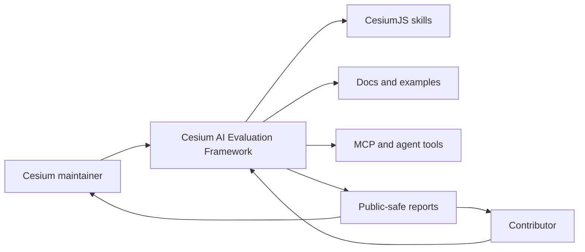
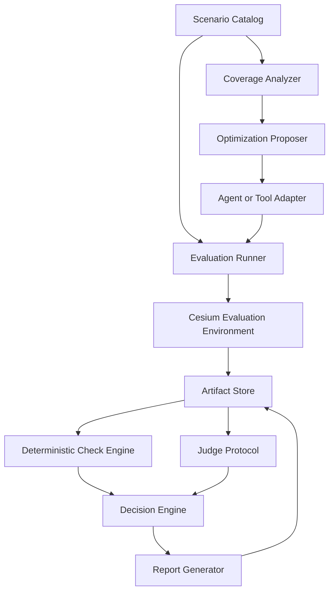
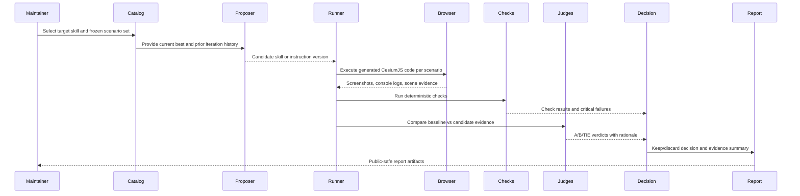
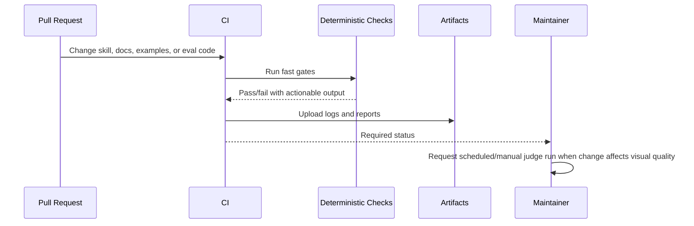
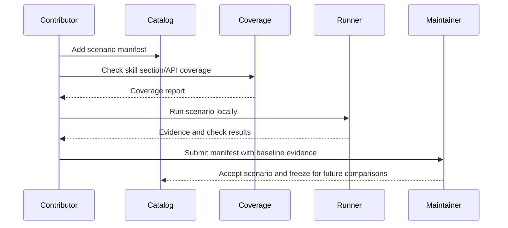

# Cesium AI Evaluation Framework Architecture Concept Document

> Audience: CesiumGS maintainers, contributors, tool authors, and developers interested in AI-assisted Cesium workflows
> Public-safety note: This document must not include private tokens, private customer data, confidential planning links, or internal-only procedures.

## Table of Contents

- [1. Introduction and Goals](#1-introduction-and-goals)
- [2. Architecture Constraints](#2-architecture-constraints)
- [3. Context and Scope](#3-context-and-scope)
- [4. Solution Strategy](#4-solution-strategy)
- [5. Building Block View](#5-building-block-view)
- [6. Runtime View](#6-runtime-view)
- [7. Deployment and Operations View](#7-deployment-and-operations-view)
- [8. Crosscutting Concepts](#8-crosscutting-concepts)
- [9. Architecture Decisions](#9-architecture-decisions)
- [10. Quality Requirements](#10-quality-requirements)
- [11. Risks and Technical Debt](#11-risks-and-technical-debt)
- [12. Glossary](#12-glossary)

# 1. Introduction and Goals

The Cesium AI Evaluation Framework measures how effectively AI coding agents generate, revise, and reason about Cesium ecosystem code and workflows. Its first concrete target is the `CesiumGS/cesiumjs-skills` repository, where skill documents guide coding agents that produce CesiumJS applications. The same architecture is intended to grow toward MCP/tool-call evaluations, Cesium ion workflow evaluations, and broader benchmarks for AI-assisted geospatial development.

The framework has two related jobs:

1. Detect regressions when skills, examples, documentation, models, prompts, or Cesium APIs change.
2. Support evidence-based improvement loops where candidate skill or tool changes are proposed, evaluated, judged, and either accepted or rejected.

## 1.1 Objectives

| Requirement code | Description |
|------------------|-------------|
| CAEF.OB.1 | Provide maintainers with repeatable evidence about whether AI agents produce correct Cesium outputs. |
| CAEF.OB.2 | Block or flag regressions before skill, documentation, example, or tool changes are published. |
| CAEF.OB.3 | Enable iterative improvement of skill documents and future tool instructions through a propose, evaluate, decide loop. |
| CAEF.OB.4 | Establish a public, reusable benchmark pattern for measuring AI effectiveness across Cesium workflows. |
| CAEF.OB.5 | Preserve enough evidence for contributors to understand why a candidate passed, failed, or needs review. |

## 1.2 Requirements Overview

| Requirement code | Description |
|------------------|-------------|
| CAEF.RG.1 | MUST define evaluation scenarios as versioned, reviewable manifests. |
| CAEF.RG.2 | MUST execute generated CesiumJS code or future tool-call workflows in a controlled evaluation environment. |
| CAEF.RG.3 | MUST capture structured evidence: inputs, candidate version, runtime metadata, programmatic checks, visual artifacts, judge verdicts, and final decision. |
| CAEF.RG.4 | MUST separate deterministic checks from LLM or human judgment. |
| CAEF.RG.5 | MUST use pairwise A/B/TIE judging for visual or qualitative comparisons where absolute numeric scores are unstable. |
| CAEF.RG.6 | MUST support local reproduction for maintainers before CI or release gates rely on the framework. |
| CAEF.RG.7 | SHOULD support CI modes with cost-aware trigger policies. |
| CAEF.RG.8 | SHOULD support future MCP/tool-call evaluations without requiring the current skills-only workflow to wait for that runtime. |
| CAEF.RG.9 | SHOULD expose public-safe summaries that contributors can inspect without access to private traces or credentials. |
| CAEF.RG.10 | MAY compute dashboard scores from structured evidence, but final keep/discard decisions must remain explainable. |

## 1.3 Quality Goals

| Requirement code | Description |
|------------------|-------------|
| CAEF.RQ.1 | Re-running deterministic checks against the same captured output and rubric version MUST produce the same result. [#reliable] |
| CAEF.RQ.2 | A maintainer SHOULD be able to identify the likely cause of a failed evaluation within 10 minutes from committed or generated artifacts. [#operable] |
| CAEF.RQ.3 | Adding a new scenario SHOULD require a manifest, expected behaviors, visual expectations where relevant, and programmatic checks; it should not require custom runner code by default. [#maintainable] |
| CAEF.RQ.4 | Pull-request checks SHOULD stay within practical contributor-runtime and cost budgets by using deterministic gates by default and scheduled/manual LLM judging where needed. [#efficient] |
| CAEF.RQ.5 | Public artifacts MUST avoid private tokens, local paths, private prompts, customer data, and confidential implementation details. [#secure] |
| CAEF.RQ.6 | Benchmark scenarios SHOULD measure behavior that matters to Cesium users, not only superficial API-pattern compliance. [#suitable] |

## 1.4 Stakeholders

| Stakeholder | Expectations |
|-------------|--------------|
| CesiumJS skills maintainers | Know whether skill edits improve or regress generated CesiumJS output. |
| CesiumGS reviewers | Review benchmark methodology, scenario coverage, scoring logic, and release-readiness evidence. |
| Contributors | Understand how to add scenarios, interpret failures, and improve skills or examples. |
| Agent and tool integrators | Compare behavior across model, tool, prompt, and skill versions. |
| Documentation and developer-experience maintainers | See how docs, examples, and tutorials affect AI-assisted developer outcomes. |
| Future MCP/tool maintainers | Reuse the evaluation concepts for tool selection, schema validation, orchestration, and error recovery. |

# 2. Architecture Constraints

| Constraint | Impact |
|------------|--------|
| Public repository compatibility | Canonical design docs and committed artifacts must be safe for public review. |
| AI judge variance | Absolute numeric LLM scores are not reliable enough for small visual differences; pairwise comparison is required for visual decisions. |
| Cesium visual correctness | Some workflows can only be judged by executing code and inspecting rendered scenes, screenshots, or scene state. |
| Cost of LLM evaluation | CI cannot assume that every commit can afford a full multi-judge visual suite. |
| Skills are currently markdown-only | The first implementation evaluates generated code from skill guidance, not MCP tool calls. |
| Future MCP/tool workflows | The architecture must not block later evaluation of structured tool calls and tool orchestration. |
| Reproducibility | Scenario manifests, runner versions, model/tool settings, and judge protocols must be versioned or captured. |
| Credential safety | Cesium ion tokens and other credentials must stay local or in CI secrets and must never be committed in generated traces. |
| Benchmark validity | Frozen eval sets are needed for fair comparisons, but new scenarios are also needed as Cesium APIs and user workflows evolve. |

# 3. Context and Scope

## 3.1 What is the Cesium AI Evaluation Framework

The framework is a set of conventions, manifests, runners, checks, judge protocols, artifacts, and documentation for evaluating AI-assisted Cesium development. Its first public implementation lives under `evals/` in this repository.

It evaluates whether an AI agent, given a particular skill or tool context, produces an output that satisfies the scenario. For CesiumJS skill evaluations, that output is usually JavaScript code that is executed in a browser-backed Cesium scene. For future MCP evaluations, the output may be a sequence of structured tool calls and observed scene state.

## 3.2 What the Framework Is Not

The framework is not:

- A replacement for CesiumJS unit tests or integration tests.
- A benchmark of CesiumJS rendering performance.
- A private leaderboard for model vendors.
- A guarantee that a model will succeed on every user prompt.
- A production monitoring service or SLA.
- A place to store private traces, credentials, local machine paths, or confidential prompts.

## 3.3 Product Context



The framework sits between changes to Cesium guidance or tooling and decisions about whether those changes are good enough to publish. It provides evidence for maintainers and a contribution path for community members.

## 3.4 Technical Context

```mermaid
flowchart LR
    Scenario["Scenario manifest<br/>prompt, expectations, checks"]
    Candidate["Candidate context<br/>skill, prompt, model, tool config"]
    Baseline["Baseline context<br/>current best or release target"]
    Adapter["Agent or tool adapter"]
    Runner["Evaluation runner"]
    Environment["Browser-backed<br/>Cesium environment"]
    Evidence["Evidence bundle<br/>metadata, logs, scene state, screenshots"]
    Checks["Deterministic checks<br/>schema, API, runtime gates"]
    Judges["Pairwise judges<br/>BASELINE / CANDIDATE / TIE"]
    Decision["Decision engine<br/>keep, discard, or review"]
    Report["Report and history"]
    Summary["Public-safe summary<br/>sanitized results and curated artifacts"]
    Analysis["Regression analysis<br/>coverage gaps, failure patterns"]
    Proposal["Candidate update<br/>skill, docs, examples, tools"]
    Review["Maintainer review<br/>accept, revise, or reject"]

    Scenario -->|defines task| Runner
    Candidate -->|candidate under test| Adapter
    Baseline -->|comparison target| Adapter
    Adapter -->|generates output| Runner
    Runner -->|executes in| Environment
    Environment -->|captures| Evidence
    Evidence -->|programmatic facts| Checks
    Evidence -->|visual and qualitative evidence| Judges
    Checks -->|gates| Decision
    Judges -->|majority verdict| Decision
    Decision -->|records outcome| Report
    Report -->|publishes| Summary
    Report -.->|drives next iteration| Analysis
    Summary -.->|informs maintainers| Analysis
    Analysis -.-> Proposal
    Proposal -.-> Review
    Review -.->|updates context| Candidate
    Review -.->|adds or refines coverage| Scenario

    classDef input fill:#e8f3ff,stroke:#2563eb,color:#0f172a
    classDef execute fill:#ecfdf3,stroke:#16a34a,color:#0f172a
    classDef evidence fill:#fff7ed,stroke:#f97316,color:#0f172a
    classDef policy fill:#f5f3ff,stroke:#7c3aed,color:#0f172a
    classDef output fill:#f8fafc,stroke:#475569,color:#0f172a
    classDef iterate fill:#fff1f2,stroke:#e11d48,color:#0f172a
    class Scenario,Candidate,Baseline input
    class Adapter,Runner,Environment execute
    class Evidence evidence
    class Checks,Judges,Decision policy
    class Report,Summary output
    class Analysis,Proposal,Review iterate
```



Public v1 repository artifacts include:

- `evals/scenarios/<skill>/*.json` public-safe scenario manifests.
- `evals/results/public-status.json` sanitized current-best and decision summaries.
- `evals/schemas/scenario.schema.json` human-readable scenario schema.
- `scripts/validate-evals.py` deterministic scenario and summary validation.
- `scripts/check-public-artifacts.py` public-facing artifact safety scan.
- `scripts/run-public-eval.py` local browser-backed reproduction runner.
- `.github/workflows/evals.yml` lightweight public eval validation in CI.

Local tuning history and raw traces may exist outside this public surface, but they are not the public source of truth and must not be required to understand the wiki or ACD.

# 4. Solution Strategy

## 4.1 Core Functionality

| Capability | Approach |
|------------|----------|
| Scenario definition | Store human-readable JSON manifests with prompt, expected behavior, visual expectations, programmatic checks, screenshot timings, and regression criticality. |
| Candidate execution | Execute generated code or future tool-call workflows against a controlled Cesium environment with fixed viewport and captured runtime metadata. |
| Deterministic checking | Run code execution, console-error, API-pattern, forbidden-pattern, schema, and structural checks without LLM judgment. |
| Visual and qualitative judgment | Use pairwise A/B/TIE comparison with three independent judges and majority vote for visual or qualitative decisions. |
| Decision policy | Keep or reject candidates through deterministic rules: critical regressions block, pairwise wins/losses decide, ties preserve current best. |
| Optimization loop | Let an agent inspect full prior history and propose revised skill/tool instructions; evaluate each proposal before adoption. |
| Public evidence | Commit public-safe scores, decisions, judge summaries, scenario manifests, and curated screenshots; keep raw credential-bearing traces out of git. |
| Future expansion | Keep skills-first implementation independent of MCP runtime while designing interfaces that can later evaluate tool calls. |

## 4.2 Requirement Traceability

| Requirements or constraints | Solution approach |
|-----------------------------|-------------------|
| CAEF.RG.1, CAEF.RQ.3 | Versioned scenario manifests with common fields and reviewable naming. |
| CAEF.RG.2 | Browser-backed runner for CesiumJS code today; adapter boundary for future MCP/tool-call runs. |
| CAEF.RG.3, CAEF.RQ.2 | Structured trace, score, decision, and report artifacts with human-readable summaries. |
| CAEF.RG.4, CAEF.RQ.1 | Deterministic checks are recorded separately from judge verdicts. |
| CAEF.RG.5 | Pairwise A/B/TIE judging with three independent judges and majority vote. |
| CAEF.RG.6 | Local runner and documented reproduction commands remain first-class. |
| CAEF.RG.7, CAEF.RQ.4 | CI strategy separates cheap deterministic PR checks from scheduled/manual LLM judge runs. |
| CAEF.RG.8 | Skills-first runner does not depend on MCP runtime; future adapters can add MCP mode. |
| CAEF.RG.9, CAEF.RQ.5 | Public artifact policy excludes raw traces that can contain tokens, local paths, or private prompt text. |
| CAEF.RG.10, CAEF.RQ.6 | Numeric scores are derived from structured evidence for reporting; final decisions remain rule-based and explainable. |

# 5. Building Block View

## 5.1 Level 1



| Building block | Responsibility |
|----------------|----------------|
| Scenario Catalog | Owns eval manifests, task taxonomy, regression-critical labels, and expected behaviors. |
| Coverage Analyzer | Maps skill sections, code examples, and API references to scenario coverage. |
| Optimization Proposer | Reads prior history and proposes candidate skill or instruction changes. |
| Agent or Tool Adapter | Invokes the evaluated agent mode, model, skill context, or future MCP tool workflow. |
| Evaluation Runner | Orchestrates selected scenarios, runtime setup, artifact capture, and check execution. |
| Cesium Evaluation Environment | Provides browser-backed Cesium execution, viewer reset, screenshot capture, and scene-state inspection. |
| Deterministic Check Engine | Applies code execution, console, regex/API, schema, and structural checks. |
| Judge Protocol | Runs independent pairwise visual or qualitative comparisons and records structured verdicts. |
| Decision Engine | Applies critical-regression gates, majority votes, tie rules, and optional maintainer overrides. |
| Artifact Store | Stores manifests, generated outputs, screenshots, logs, scores, decisions, and reports according to public-safety policy. |
| Report Generator | Produces maintainer-readable summaries and machine-readable result data. |

## 5.2 Scenario Catalog

The scenario catalog is the unit of benchmark intent. Each scenario should include:

- Stable `id` and human-readable `name`.
- Prompt or task description.
- Target skill/tool domain.
- Expected behaviors.
- Visual expectations when relevant.
- Programmatic checks.
- Screenshot or scene-state capture plan.
- Regression criticality.
- Metadata for persona, migration/deprecated API coverage, difficulty, and failure taxonomy where applicable.

Scenarios should be frozen for a comparison window. New or modified scenarios require re-baselining before they are used to judge candidate improvements.

## 5.3 Evaluation Runner

The current runner materializes or drives a browser-backed Cesium page, executes generated JavaScript, captures console output and screenshots, and writes programmatic check results. The runner is intentionally runtime-independent: it evaluates generated CesiumJS code today and can grow an adapter for MCP tool-call sequences later.

## 5.4 Judge and Decision Engine

Judges do not assign primary absolute quality scores for visual decisions. They compare current-best output against candidate output for the same scenario and respond with `BASELINE`, `CANDIDATE`, or `TIE`, plus rationale. The decision engine aggregates three independent verdicts per scenario and applies deterministic rules:

1. If a candidate loses any regression-critical scenario, reject it.
2. If candidate wins exceed baseline wins, keep it.
3. If baseline wins exceed candidate wins, reject it.
4. If the result is a tie, keep the current best unless a maintainer explicitly overrides with rationale.

# 6. Runtime View

## 6.1 Evaluate a Skills Candidate



## 6.2 Pull Request Validation



Pull-request CI should not require the full LLM judge suite by default. Expensive visual judging belongs on scheduled, manual, release, or high-risk triggers until cost and reliability are proven.

## 6.3 Add a New Scenario



# 7. Deployment and Operations View

The framework should support three operational tiers.

| Tier | Purpose | Current or target behavior |
|------|---------|----------------------------|
| Tier 1: Archival evaluation record | Preserve methodology, scenarios, selected scores, judge verdicts, decisions, and curated screenshots. | Public v1 content under `evals/scenarios/` and `evals/results/`. |
| Tier 2: Reproducible local and CI harness | Run deterministic checks and selected visual scenarios from a clean checkout with documented commands. | `scripts/validate-evals.py`, `scripts/check-public-artifacts.py`, `scripts/run-public-eval.py`, and `.github/workflows/evals.yml`. |
| Tier 3: MCP/tool-call evaluation | Evaluate structured tool selection, schema validation, multi-tool orchestration, error recovery, and final scene state. | Future target once relevant MCP/tool runtimes are mature enough. |

Operational policies:

- Local runs are the reference path for debugging.
- CI starts with deterministic gates and stores public-safe artifacts.
- Full visual judge suites are scheduled, manual, or release-gated until cost and stability justify broader use.
- Raw traces that may contain tokens, local paths, or private prompts remain ignored and are regenerated locally when needed.
- Public reports should prefer relative paths, redacted metadata, curated screenshots, and structured summaries.

# 8. Crosscutting Concepts

## 8.1 Reproducibility

Each evaluation run should capture:

- Scenario manifest version.
- Candidate skill/tool version.
- Current-best comparison target.
- Runner version.
- Browser viewport and environment.
- Model/tool/provider identifier where available.
- Temperature and generation settings where available.
- Rubric or judge protocol version.
- Artifact hashes or paths.

Changing any comparison-critical parameter invalidates direct comparison with older runs unless the system explicitly re-baselines.

## 8.2 Public-Safe Artifact Policy

Committed artifacts may include:

- Scenario manifests.
- Coverage reports.
- Programmatic check summaries.
- Judge verdict summaries.
- Decision records.
- Public-safe curated screenshots.
- Public-safe report summaries.

Ignored or redacted artifacts include:

- HTML with embedded access tokens.
- Raw prompts containing local paths or private context.
- Full console captures if they include credentials or local machine data.
- Raw generated traces that are not reviewed for public release.
- Private customer data or private repository links.

## 8.3 Scoring and Decision Policy

The framework uses structured evidence before scoring:

```text
agent output -> deterministic checks + judge verdicts -> decision policy -> report score
```

Numeric scores are useful for dashboards, trends, and prioritization. They should be computed from deterministic components and structured judge outputs, not treated as opaque LLM opinion. A typical reporting score may include:

- Programmatic correctness.
- API accuracy.
- Visual pairwise outcome.
- Regression status.
- Coverage contribution.
- Operability of artifacts.

The keep/discard decision remains rule-based so maintainers can explain why a candidate changed status.

## 8.4 Evaluation Dataset Design

Scenario design should include:

- Core Cesium workflows first: viewer setup, camera, entities, imagery, terrain, 3D Tiles, interaction, time, spatial math, custom shaders, models, primitives, materials, and utilities.
- Persona variants: beginner, intermediate, expert, and API migrator.
- Migration and deprecated API scenarios.
- Failure taxonomy metadata: wrong API, hallucinated method, missing async, wrong coordinate sign, missing token handling, broken visual framing, stale docs, and domain-boundary violation.
- Iconic landmarks for visual tasks where landmarks make judging more reliable.

## 8.5 Optimization Loop

The optimization proposer should inspect prior artifacts directly rather than only reading compressed score summaries. The strongest improvement loop is:

1. Inspect failures and prior decisions.
2. Form hypotheses tied to specific scenario evidence.
3. Propose a candidate change.
4. Re-run the same frozen eval set.
5. Judge pairwise against current best.
6. Keep, discard, or require maintainer review.
7. Preserve the reasoning and decision.

## 8.6 Extensibility to MCP and Tool Workflows

Future MCP/tool-call evaluations should add dimensions that are not central to markdown-only skills:

- Tool selection accuracy.
- Schema-valid inputs.
- Multi-tool orchestration.
- Confirmation and destructive-action handling.
- Error recovery.
- Scene-state verification after tool calls.
- Token/context efficiency of available tool sets.

Tool count and tool descriptions should be part of the eval surface, because overly broad tool sets can reduce agent performance.

# 9. Architecture Decisions

Detailed ADRs live beside this document:

| ADR | Decision |
|-----|----------|
| [ADR-0001](ADR-0001-Skills-First-Sequencing) | Use skills-first sequencing, then generalize to broader Cesium evals. |
| [ADR-0002](ADR-0002-Pairwise-Judge-Protocol) | Use pairwise A/B/TIE judging with three independent judges. |
| [ADR-0003](ADR-0003-Deterministic-Decision-Policy) | Keep deterministic gates and rule-based decisions separate from report scores. |
| [ADR-0004](ADR-0004-Browser-Visual-Evaluation) | Use browser-backed visual evaluation for CesiumJS scenarios. |
| [ADR-0005](ADR-0005-CI-Trigger-Policy) | Run cheap deterministic checks in PR CI and reserve expensive judge suites for scheduled/manual/release workflows. |
| [ADR-0006](ADR-0006-Public-Artifact-Policy) | Commit public-safe evidence and keep raw sensitive traces out of git. |

# 10. Quality Requirements

| Quality | Scenario |
|---------|----------|
| Repeatability | Re-running deterministic checks on the same captured output and scenario manifest produces the same pass/fail results. |
| Judge stability | A visual decision uses three independent pairwise judges; the final result is the majority verdict, not a single score. |
| Debuggability | A maintainer can inspect a failed run and see which scenario, check, screenshot, or judge rationale drove the decision. |
| Cost control | A routine PR can pass required deterministic checks without running a full LLM visual judge suite. |
| Public safety | Secret scanning and artifact policy prevent committed tokens, private paths, or private prompts from entering public history. |
| Extensibility | A future MCP adapter can add tool-call evaluation without replacing the skills runner and scenario catalog. |
| Benchmark relevance | Scenario coverage maps to skill sections, code examples, public API workflows, and known failure modes. |

# 11. Risks and Technical Debt

| Risk | Priority | Mitigation |
|------|----------|------------|
| Benchmarks overfit skill wording to narrow scenarios. | High | Expand scenario coverage, add persona and migration variants, and freeze comparison sets only for bounded windows. |
| Visual judges remain noisy even with pairwise comparison. | High | Use three independent judges, majority vote, deterministic critical gates, and maintainer override only with rationale. |
| Programmatic checks reward superficial regex compliance. | High | Combine regex/API checks with execution, scene evidence, screenshots, and qualitative review. |
| Full LLM judging is too expensive for normal CI. | High | Use deterministic PR gates, scheduled/manual visual runs, and sampled release gates. |
| Raw traces can contain credentials or local paths. | High | Keep traces ignored by default, run secret scans, and publish only curated artifacts. |
| Scenario manifests drift from current Cesium APIs. | Medium | Version manifests, tie updates to release cadence, and require re-baselining when comparison-critical behavior changes. |
| MCP/tool evals arrive before tool APIs are stable. | Medium | Keep MCP evals out of the core path until public tool contracts and stable API surfaces exist. |
| Ownership is unclear after publication. | Medium | Define CODEOWNERS, review policy, scenario acceptance criteria, and CI responsibilities. |
| The framework is perceived as a model leaderboard. | Medium | Position it as a Cesium workflow quality tool, focused on docs, skills, examples, and tool design. |

# 12. Glossary

| Term | Definition |
|------|------------|
| ACD | Architecture Concept Document, an architecture document explaining goals, constraints, structure, runtime behavior, decisions, risks, and terminology. |
| ADR | Architecture Decision Record, a short record of a significant architecture decision and its rationale. |
| Candidate | The skill, prompt, instruction, tool, or code version being evaluated against a baseline or current best. |
| Current best | The accepted version that a candidate must beat or tie without critical regressions. |
| Deterministic check | A check whose result is computed without LLM judgment, such as code execution or API-pattern validation. |
| Evaluation scenario | A versioned manifest describing a task, expected behaviors, checks, artifacts, and regression policy. |
| Judge | A human or LLM evaluator that compares evidence and returns a structured verdict. |
| Pairwise judging | A comparison protocol where a judge chooses between baseline, candidate, or tie for the same scenario. |
| Programmatic check | A deterministic automated check, often based on execution result, console state, schema, or code pattern. |
| Regression-critical scenario | A scenario where a candidate loss blocks acceptance regardless of aggregate score. |
| Report score | A numeric or categorical summary derived from structured evidence; useful for dashboards but secondary to decision policy. |
| Skill | A markdown instruction package that guides an AI agent in a domain such as CesiumJS camera control or imagery. |
| Trace | Runtime evidence from an evaluation, such as generated code, HTML, console output, screenshots, and metadata. |

**_Created following the [arc42](https://arc42.org/) template_**

arc42, the Template for documentation of software and system architecture.

By Dr. Gernot Starke, Dr. Peter Hruschka and contributors.

This document uses material from the arc42 architecture template, https://arc42.org, licensed under Creative Commons Attribution 4.0 International.
