# Home

The CesiumJS Skills wiki is generated from source-controlled Markdown in the `wiki/` directory of the `CesiumGS/cesiumjs-skills` repository. Changes should be proposed through pull requests to the source repository rather than edited directly in the GitHub wiki.

## What This Wiki Covers

This wiki currently focuses on the Cesium AI Evaluation Framework: the architecture, decisions, and operating model for evaluating AI-assisted Cesium development workflows.

The framework starts with `CesiumGS/cesiumjs-skills`, where skill documents guide coding agents that generate CesiumJS code. The same approach is designed to grow toward MCP/tool-call evaluations, Cesium ion workflow evaluations, and broader benchmarks for AI-assisted geospatial development.

## Start Here

1. [Architecture Concept Document](Architecture-Concept-Document) - Goals, constraints, building blocks, runtime views, decisions, risks, and glossary.
2. [Run Skill Evaluations Locally](Run-Skill-Evaluations-Locally) - How to validate manifests and reproduce selected browser scenarios.
3. [Add an Evaluation Scenario](Add-Evaluation-Scenario) - How to add public-safe scenario manifests.
4. [Public Artifact Policy](Public-Artifact-Policy) - Which eval artifacts can be committed publicly.
5. [ADR-0001: Skills-First Sequencing](ADR-0001-Skills-First-Sequencing) - Why the initial implementation starts in `cesiumjs-skills`.
6. [ADR-0002: Pairwise Judge Protocol](ADR-0002-Pairwise-Judge-Protocol) - Why visual evaluation uses A/B/TIE comparison with three independent judges.
7. [ADR-0003: Deterministic Decision Policy](ADR-0003-Deterministic-Decision-Policy) - How gates, verdicts, and report scores are separated.

## Architecture Overview

```mermaid
flowchart LR
    subgraph Inputs["Versioned Inputs"]
        direction TB
        Scenario["Scenario manifest<br/>prompt, expectations, checks"]
        Candidate["Candidate context<br/>skill, prompt, model, tool config"]
        Baseline["Baseline context<br/>current best or release target"]
    end

    subgraph Execution["Controlled Execution"]
        direction TB
        Adapter["Agent or tool adapter"]
        Runner["Evaluation runner"]
        Environment["Browser-backed<br/>Cesium environment"]
    end

    subgraph Evidence["Captured Evidence"]
        direction TB
        Runtime["Runtime metadata"]
        Console["Console and page errors"]
        Scene["Scene state"]
        Screenshots["Screenshots"]
    end

    subgraph Evaluation["Evaluation Policy"]
        direction TB
        Checks["Deterministic checks<br/>schema, API, runtime gates"]
        Judges["Pairwise judges<br/>BASELINE / CANDIDATE / TIE"]
        Decision["Decision engine<br/>keep, discard, or review"]
    end

    subgraph Outputs["Public-Safe Outputs"]
        direction TB
        Report["Report and history"]
        Summaries["Sanitized summaries"]
        Artifacts["Curated artifacts"]
    end

    Scenario --> Runner
    Candidate --> Adapter
    Baseline --> Adapter
    Adapter --> Runner
    Runner --> Environment
    Environment --> Runtime
    Environment --> Console
    Environment --> Scene
    Environment --> Screenshots
    Runtime --> Checks
    Console --> Checks
    Scene --> Checks
    Screenshots --> Judges
    Scene --> Judges
    Checks --> Decision
    Judges --> Decision
    Decision --> Report
    Report --> Summaries
    Report --> Artifacts

    classDef input fill:#e8f3ff,stroke:#2563eb,color:#0f172a
    classDef execute fill:#ecfdf3,stroke:#16a34a,color:#0f172a
    classDef evidence fill:#fff7ed,stroke:#f97316,color:#0f172a
    classDef policy fill:#f5f3ff,stroke:#7c3aed,color:#0f172a
    classDef output fill:#f8fafc,stroke:#475569,color:#0f172a
    class Scenario,Candidate,Baseline input
    class Adapter,Runner,Environment execute
    class Runtime,Console,Scene,Screenshots evidence
    class Checks,Judges,Decision policy
    class Report,Summaries,Artifacts output
```

## External Links

- [Source repository](https://github.com/CesiumGS/cesiumjs-skills)
- [CesiumJS](https://github.com/CesiumGS/cesium)
- [CesiumJS documentation](https://cesium.com/learn/cesiumjs/ref-doc/)
- [Model Context Protocol](https://modelcontextprotocol.io/)
