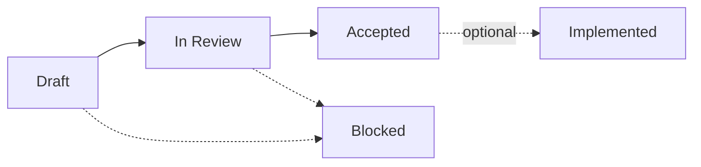

# Status Dashboard

This dashboard tracks source-controlled wiki pages for the Cesium AI Evaluation Framework. The GitHub wiki is generated from the repository's `wiki/` directory.

## Current Status Overview

| Document | Status | Updated |
|---|---|---|
| [Home](Home) |  | 5/14/26 |
| [Architecture Concept Document](Architecture-Concept-Document) |  | 5/14/26 |
| [Run Skill Evaluations Locally](Run-Skill-Evaluations-Locally) |  | 5/14/26 |
| [Add an Evaluation Scenario](Add-Evaluation-Scenario) |  | 5/14/26 |
| [Public Artifact Policy](Public-Artifact-Policy) |  | 5/14/26 |
| [ADR-0001: Skills-First Sequencing](ADR-0001-Skills-First-Sequencing) |  | 5/14/26 |
| [ADR-0002: Pairwise Judge Protocol](ADR-0002-Pairwise-Judge-Protocol) |  | 5/14/26 |
| [ADR-0003: Deterministic Decision Policy](ADR-0003-Deterministic-Decision-Policy) |  | 5/14/26 |
| [ADR-0004: Browser Visual Evaluation](ADR-0004-Browser-Visual-Evaluation) |  | 5/14/26 |
| [ADR-0005: CI Trigger Policy](ADR-0005-CI-Trigger-Policy) |  | 5/14/26 |
| [ADR-0006: Public Artifact Policy](ADR-0006-Public-Artifact-Policy) |  | 5/14/26 |

## Status Indicators

 **Draft** - Being written and refined.

 **In Review** - Under review by maintainers.

 **Accepted** - Decision is accepted or document is ready to use.

 **Implemented** - Complete with working implementation.

 **Blocked** - Waiting on dependencies.

## Notes

